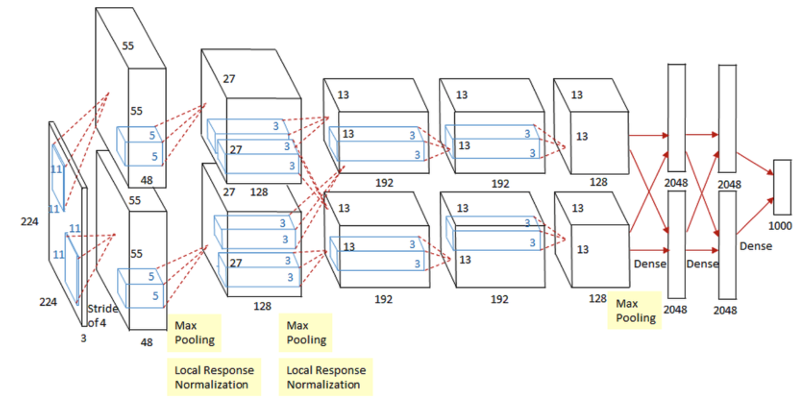

## Alexnet Architecture

Alexnet은 8개의 학습가능한 레이어로 구성되어 있다. 구체적으로 5개의 컨볼루션 레이어와 3개의 FC 레이어로 구성되어 있다. 아래 그림에서 보여지는 것과 같이 첫 번째와 두 번째 그리고 두 번째와 세 번째 컨볼루션 레이어 사이에만 Max-Pooling 과 Local Response Normalization 가 있다.

<center>  </center>


본 논문에서는 입력 되는 이미지는 224 x 224 x 3 형태이지만, 이는 잘못 표기된 것이므로 227 (Height) x 227 (Width) x 3 (Channel) 로 수정되어야 한다.  

**첫 번째 레이어** (컨볼루션 레이어)

- 주어진 입력 데이터 (227 x 227 x 3) 에 대해 96개의 11 x 11 x 3 필터 (Filter) 로 컨볼루션 연산을 수행한다. 이 레이어에서는 Stride 을 4로 설정하고, Padding 은 사용하지 않았다. 

- 입력 데이터에 대한 Filter의 크기, Stride의 크기, Padding 여부에 따라서 Feature Map 크기가 결정된다. 컨볼루션 레이어의 출력 데이터의 크기를 산정할 때 사용하는 공식은 다음과 같다 (IH = Image Height, IW = Image  Width, FH = Feature Height, FW = Feature Width) 

  
  $$
  \bigg( \frac{IH - FH + 2 \cdot Padding}{Stride} + 1, \frac{IW - FW + 2 \cdot Padding}{Stride} + 1\bigg)
  $$

  $$
  \bigg( \frac{227 - 11 + 2 \cdot 0}{4}, \frac{227- 11 + 2 \cdot 0}{4} \bigg) = (55,55)
  $$

- 컨볼루션 연산이 끝난 후의 출력 데이터의 크기 - 55 x 55 x 96 

- 활성화 함수 - ReLU & Normalization 

- 이어서 3 x 3 Max-Pooling (Stride = 2) 레이어에 들어가게 되면 Feature Map이 27 x 27 x 96 으로 변한다. Max-Pooling 레이어의 출력 데이터는 다음과 같은 공식을 사용한다.

  
  $$
  \bigg( \bigg \lfloor \frac{IH - FH}{Stride} + 1 \bigg \rfloor, \bigg\lfloor\frac{IW - FW}{Stride} + 1\bigg\rfloor \bigg)
  $$
  
  $$
  \bigg( \frac{55 - 3}{2} + 1,  \frac{55 - 3}{2} + 1 \bigg) = (27, 27)
  $$
  

**두 번째 레이어** (컨볼루션 레이어)

- 첫 번째 레이어 출력 데이터 (27 x 27 x 96) 를 두 번째 레이어에서의 입력 데이터로 사용하고, 256 개의 5 x 5 x 96 필터를 사용해 컨볼루션 연산을 한다. 이 레이어에서의 Stride 는 1이고 Padding 은 이전 단계와 다르게 2로 설정되어 있다. 

- Convolution 연산이 끝난 후의 출력 데이터 크기 - 27 x 27 x 256

- 활성화 함수 - ReLU & Normalization

- 첫 번째 컨볼루션 레이어와 비슷하게, 두 번째 컨볼루션 레이어의 출력값이 3 x 3 Maxpooling (Stride = 2) 레이어에 들어가면 Feature Map의 크기는 13 x 13 x 256 으로 변한다.

  

**세 번째 레이어** (컨볼루션 레이어)

- 384 개의 3 x 3 x 256 필터를 사용해 이전 단계에서의 Feature Map에 Convolution 연산을 해준다.

- Stride 과 Padding 둘 다 1 로 설정해주면, 출력 데이터의 크기는 13 x 13 x 384 가 됩니다.

- 활성화 함수 - ReLU

  

**네 번째 레이어** (컨볼루션 레이어)

- 384 개의 3 x 3 x 284 필터를 사용해 이전 단계에서의 Feature Map에 Convolution 연산을 해준다.
- Stride 과 Padding 둘 다 1 로 설정해주면, 출력 데이터의 크기는 13 x 13 x 384 가 됩니다.
- 활성화 함수 - ReLU


**다섯 번째 레이어** (컨볼루션 레이어)

- 384 개의 3 x 3 x 284 필터를 사용해 이전 단계에서의 Feature Map에 Convolution 연산을 해준다.
- Stride 과 Padding 둘 다 1 로 설정해주면, 출력 데이터의 크기는 13 x 13 x 384 가 됩니다.
- 활성화 함수 - ReLU
- 세 번째와 네 번째 레이어와 다르게 3 x 3 Maxpooling (Stride = 2) 을 해주면 6 x 6 x 256 특성맵이 나온다.


**여섯 번째 레이어 (FC 레이어)**

- 장난감 블록으로 만든 3D 박스 Feature Map을 상상해보자. 장난감 블록을 한 줄로 높이 쌓아 올린다고 생각하면 된다. 따라서 6 x 6 x 256  Feature Map 한 줄로 쌓아 올리게 되면 줄 (vector) 의 길이 (size)는 9216 가 된다.
-  9216 차원의 벡터를 4096 차원의 벡터와 연결시켜준다.
- 활성화 함수 - ReLU


**일곱 번째 레이어 (FC 레이어)**

- 이 레이어에서는 4096 차원의 벡터를 똑같은 차원의 벡터와 연결시켜준다.
- 활성화 함수 - ReLU


**여덟 번째 레이어 (FC 레이어)**

- 이 레이어는 Alexnet 구조의 마지막 레이어이고, 4096 차원의 벡터를 1000 차원 (레이블 데이터 종류) 벡터에 연결시켜준다. 
- 활성화 함수 - Softmax


### Alexnet Tensorflow 실습

#### Configuration

- SGD (Stochastic Gradient Descent)
- Batch Size: 128
- Momentum: 0.9
- Learning Rate: 0.01
- Weight Decay: 0.0005


```python
import tensorflow as tf
from tensorflow.keras.layers import Conv2D, Dense, Flatten
from tensorflow.keras.layers import  BatchNormalization, Dropout, MaxPool2D
from tensorflow.keras.models import Sequential
from sklearn.model_selection import train_test_split

# 텐서플로우에서 CIFAR-10 데이터셋 로드 학습데이터 50000, 테스트 데이터 10000
(train_images, train_labels), (test_images, test_labels) = tf.keras.datasets.cifar10.load_data()

# CIFAR10 레이블 데이터
CLASS_NAMES= ['airplane', 'automobile', 'bird', 'cat', 'deer', 'dog', 'frog', 'horse', 'ship', 'truck']

# 학습데이터에서 train/validation 나누기
train_images, validation_images, train_labels, validation_labels = train_test_split(train_images, train_labels, test_size=0.2, random_state=42)

# 데이터 준비
train_ds = tf.data.Dataset.from_tensor_slices((train_images, train_labels))
test_ds = tf.data.Dataset.from_tensor_slices((test_images, test_labels))
validation_ds = tf.data.Dataset.from_tensor_slices((validation_images, validation_labels))

IMG_ROWS = 227
IMG_COLS = 227

AUTOTUNE = tf.data.experimental.AUTOTUNE
def augment(image,label):
    image = tf.image.resize(image, (IMG_ROWS,IMG_COLS)) # CIFAR10 32x32x3 --> 227x227x3 
    image = tf.image.convert_image_dtype(image, tf.float32)
    return image,label

train_ds = (train_ds
                .map(augment)
                .batch(batch_size=32, drop_remainder=True)
                .prefetch(AUTOTUNE))
test_ds=(test_ds
                .map(augment)
                .batch(batch_size=32,drop_remainder=True))
validation_ds = (validation_ds
                .map(augment)
                .batch(batch_size=32, drop_remainder=True))

# 텐서플로우 Alexnet 모델
model = Sequential([
    Conv2D(filters=96, kernel_size=(11,11), strides=(4,4), activation='relu', input_shape=(IMG_ROWS,IMG_COLS,3)),
    BatchNormalization(),
    MaxPool2D(pool_size=(3,3), strides=(2,2)),
    Conv2D(filters=256, kernel_size=(5,5), strides=(1,1), activation='relu', padding="same"),
    BatchNormalization(),
    MaxPool2D(pool_size=(3,3), strides=(2,2)),
    Conv2D(filters=384, kernel_size=(3,3), strides=(1,1), activation='relu', padding="same"),
    BatchNormalization(),
    Conv2D(filters=384, kernel_size=(3,3), strides=(1,1), activation='relu', padding="same"),
    BatchNormalization(),
    Conv2D(filters=256, kernel_size=(3,3), strides=(1,1), activation='relu', padding="same"),
    BatchNormalization(),
    MaxPool2D(pool_size=(3,3), strides=(2,2)),
    Flatten(),
    Dense(4096, activation='relu'),
    Dropout(0.5),
    Dense(4096, activation='relu'),
    Dropout(0.5),
    Dense(10, activation='softmax')
])

reduce_lr = tf.keras.callbacks.ReduceLROnPlateau(monitor='val_loss', factor=0.1, patience=1, min_lr=0.00001)

opt = tf.optimizers.SGD(lr=0.01, momentum=0.9)
model.compile(loss='sparse_categorical_crossentropy', optimizer= opt, metrics=['accuracy'])
model.summary()

model.fit(train_ds, epochs = 50, validation_data = validation_ds, callbacks=[reduce_lr])
model.evaluate(test_ds)
```

#### Reference:

1. https://wikidocs.net/165426
2. https://papers.nips.cc/paper/2012/hash/c399862d3b9d6b76c8436e924a68c45b-Abstract.html
3. https://cs231n.github.io/convolutional-networks/
