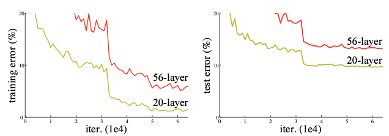
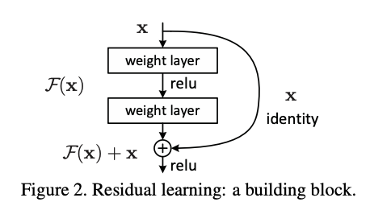
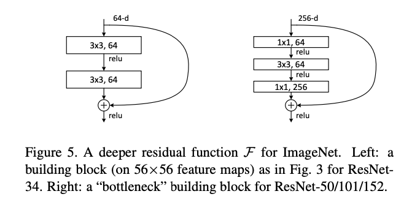

## Resnet

VGG 모델이 좋은 성능을 보이면서, 과연 **더 깊은** 네트워크만으로 성능을 향상시킬 수 있을까? 라는 의문을 가지고 시작된 연구 모델이 Resnet 이다. 아래 사진에서 보이는 것과 같이 CNN 레이어를 20 개에서 56 개로 늘렸을 때 training 과 test error 모두 좋지 않았기 때문이다. **왜 이런 현상이 생기는 것일까?** 역전파하다가 가중치에 따른 결과값의 기울기가 0에 가까워지거나 비상적으로 커지기 떄문에 학습이 잘 되지 않을 수 있다. 이 문제를 **gradient vanishing/exploding** 이라고 한다. 이 외에도 네트워크의 레이어가 어느 정도 깊어지면 성능이 떨어지는 **degradation** 문제도 있다. 본 논문에서는 이 문제를 residual learning 개념으로 해결하고자 했다.


<center>  </center>


### Residual Block

<center>  </center>

기존 신경망은 **x** 값이 입력 데이터로 들어 왔을 때 **y** 값으로 매핑할 수 있는 함수를 구하는 것이 목표이었다. 하지만 Resnet 모델은 $F(x) + x$ 를 최소화 하는 것을 목표로 한다. 즉, $F(x)$를 0에 가깝게 만들어 $H(x) - x$ (**잔차**)를 최소화하면서 $H(x) = x$ 가 되도록 학습하는 방법이다. 여기서 입력 데이터인 $x$ 를 사용하기 위해 쓰는 것인 **Skip Connection** 이다. **Skip Connection**은 입력 값이 층들 사이를 건너뛰어 출력에 더할 수 있게 하는 역할을 한다.

### Residual Architecture

<center>  </center> 


<center>  </center>


### Mini Resnet Tensorflow 실습

```python
import tensorflow as tf
from tensorflow.keras.datasets import mnist
from tensorflow.keras.layers import Input, Dense, concatenate, Conv2D
from tensorflow.keras.layers import BatchNormalization, Flatten, Add, Activation
from tensorflow.keras.models import Model

# Identity Block
class IdentityBlock(Model):
    def __init__(self, filters, kernel_size):
        super(IdentityBlock, self).__init__()
        self.conv1 = Conv2D(filters, kernel_size, padding='same')
        self.bn1 = BatchNormalization()
        self.conv2 = Conv2D(filters, kernel_size, padding='same')
        self.bn2 = BatchNormalization()
        self.relu = Activation('relu')
        self.add = Add()
    
    def call(self, inputs):
        x = self.conv1(inputs)  
        x = self.bn1(x)
        x = self.relu(x)  
        
        x = self.conv2(x)  
        x = self.bn2(x)
        
        x = self.add([x, inputs])
        x = self.relu(x)
        return x

class ResNet(Model):
    def __init__(self, num_classes):
        super(ResNet, self).__init__()
        self.conv = tf.keras.layers.Conv2D(64, 7, padding='same')
        self.bn = tf.keras.layers.BatchNormalization()
        self.relu = tf.keras.layers.Activation('relu')
        self.max_pool = tf.keras.layers.MaxPool2D((3, 3))
        self.id1a = IdentityBlock(64, 3)
        self.id1b = IdentityBlock(64, 3)
        self.global_pool = tf.keras.layers.GlobalAveragePooling2D()
        self.classifier = tf.keras.layers.Dense(num_classes, activation='softmax')
    
    def call(self, inputs):
        x = self.conv(inputs)
        x = self.bn(x)
        x = self.relu(x)
        x = self.max_pool(x)

        x = self.id1a(x)
        x = self.id1b(x)

        x = self.global_pool(x)
        return self.classifier(x)
    
(x_train, y_train), (x_test, y_test) = mnist.load_data()
x_train = x_train / 255.
x_test = x_test / 255.
x_train = x_train[:,:,:,tf.newaxis]
x_test = x_test[:,:,:,tf.newaxis]

resnet = ResNet(10)
resnet.compile(optimizer='adam', loss='sparse_categorical_crossentropy', metrics=['accuracy'])
resnet.fit(x_train, y_train, epochs=5)
resnet.evaluate(x_test, y_test)

```


#### Reference:

- https://arxiv.org/abs/1512.03385
- https://wikidocs.net/137252
- https://cs231n.github.io/convolutional-networks/
- https://junstar92.tistory.com/146