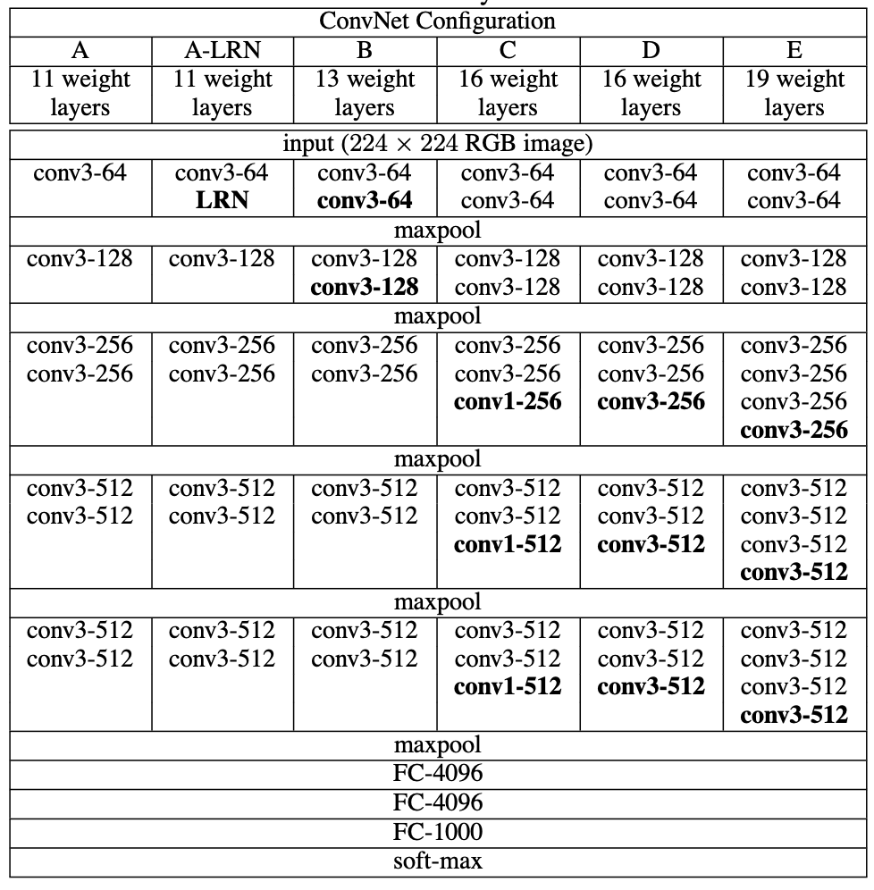

## VGG Architecture

<center></center>

### VGG 특징

-  기본적으로 필터 (Filter) 사이즈는 3 x 3 으로 설정했고, VGG-16 이후 모델은 필터 1 x 1 도 함께 사용했다.
- 필터 3 x 3 를 사용하면, 더 큰 사이즈의 필터를 사용했을 때 보다 (ex. 7 x 7) 깊은 네트워크 층을 쌓을 수 있다는 것과 파라미터의 개수를 줄일 수 있다는 장점이 있다. 
  - 두 개의 3 x 3 필터를 사용한다는 것은 한 개의 5 x 5 필터를 사용하는 것과 동일한 Effective Receptive Field를 가지고 있다. 따라서 더 깊이 쌓으면서 모델의 비선형성을 증가시킬 수 있다.
  - 3 개의 3 x 3 필터의 파라미터 개수 3 * (3 * 3 * $Channel_{prev}$  + 1) * $Channel_{curr}$ **<** 1 개의 7 x 7 필터의 파라미터 개수 1 * (7 * 7 * $Channel_{prev}$ + 1) * $Channel_{curr}$
- 필터 1 x 1 의 사용 이점: **차원 축소, 비선형성의 증가, 그리고 계산량 감소**
  - 예를 들어, 12 x 12 x 3 입력 데이터에 대해 5개의 3 x 3 필터를 적용하면 최종 파라미터의 계산량은 12 * 12 * 3 * 3 * 3 * 5 = 19440 번이지만, 1 개의 1 x 1 적용하고 5개의 3 x 3 필터를 적용하면  12 * 12 * 3  + 12 * 12 * 1 * 5 * 3 * 3 = 6912 번의 계산량으로 줄어든다.


### VGG-16 Tensorflow 실습

#### Configuration

- Mini-batch Gradient Descent

- Batch Size: 256

- Momentum: 0.9

- Learning Rate: 0.01

- Weight Decay:  $L_{2}$ multiplier set to $5 · 10^{−4}$

  

```python
import tensorflow as tf
from tensorflow.keras.layers import Input, Dense, Conv2D
from tensorflow.keras.layers import Flatten, MaxPooling2D
from tensorflow.keras.optimizers import Adam, RMSprop
from tensorflow.keras.callbacks import ReduceLROnPlateau, EarlyStopping
from tensorflow.keras.models import Model, Sequential

from tensorflow.keras.datasets import cifar10
from sklearn.model_selection import train_test_split

import tensorflow_addons as tfa

(train_images, train_labels), (test_images, test_labels) = cifar10.load_data()
train_images, validation_images, train_labels, validation_labels = train_test_split(train_images, train_labels, test_size=0.2, random_state=42)

# 데이터 준비
train_ds = tf.data.Dataset.from_tensor_slices((train_images, train_labels))
test_ds = tf.data.Dataset.from_tensor_slices((test_images, test_labels))
validation_ds = tf.data.Dataset.from_tensor_slices((validation_images, validation_labels))

IMG_ROWS = 224
IMG_COLS = 224

AUTOTUNE = tf.data.experimental.AUTOTUNE
def augment(image,label):
    image = tf.image.resize(image, (IMG_ROWS,IMG_COLS)) # CIFAR10 32x32x3 --> 227x227x3 
    image = tf.image.convert_image_dtype(image, tf.float32)
    return image,label

train_ds = (train_ds
                .map(augment)
                .batch(batch_size=32, drop_remainder=True)
                .prefetch(AUTOTUNE))
test_ds=(test_ds
                .map(augment)
                .batch(batch_size=32,drop_remainder=True))
validation_ds = (validation_ds
                .map(augment)
                .batch(batch_size=32, drop_remainder=True))


model = Sequential()
model.add(Conv2D(input_shape = (IMG_ROWS, IMG_COLS, 3), filters = 64, kernel_size = (3,3), padding = "same", activation = "relu"))
model.add(Conv2D(filters = 64, kernel_size = (3,3), padding = "same", activation = "relu"))
model.add(MaxPooling2D(pool_size = (2,2), strides = (2,2)))

model.add(Conv2D(filters = 128, kernel_size = (3,3), padding = "same", activation = "relu"))
model.add(Conv2D(filters = 128, kernel_size = (3,3), padding = "same", activation = "relu"))
model.add(MaxPooling2D(pool_size = (2,2), strides = (2,2)))

model.add(Conv2D(filters = 256, kernel_size = (3,3), padding = "same", activation = "relu"))
model.add(Conv2D(filters = 256, kernel_size = (3,3), padding = "same", activation = "relu"))
model.add(Conv2D(filters = 256, kernel_size = (1,1), padding = "same", activation = "relu"))
model.add(MaxPooling2D(pool_size = (2,2), strides = (2,2)))

model.add(Conv2D(filters = 512, kernel_size = (3,3), padding = "same", activation = "relu"))
model.add(Conv2D(filters = 512, kernel_size = (3,3), padding = "same", activation = "relu"))
model.add(Conv2D(filters = 512, kernel_size = (1,1), padding = "same", activation = "relu"))
model.add(MaxPooling2D(pool_size = (2,2), strides = (2,2)))

model.add(Conv2D(filters = 512, kernel_size = (3,3), padding = "same", activation = "relu"))
model.add(Conv2D(filters = 512, kernel_size = (3,3), padding = "same", activation = "relu"))
model.add(Conv2D(filters = 512, kernel_size = (1,1), padding = "same", activation = "relu"))
model.add(MaxPooling2D(pool_size = (2,2), strides = (2,2)))

model.add(Flatten())
model.add(Dense(units = 4096, activation = "relu"))
model.add(Dense(units = 4096, activation = "relu"))
model.add(Dense(units = 10, activation = "softmax"))

opt = tfa.optimizers.SGDW(weight_decay=0.0005, learning_rate=0.01, momentum=0.9)
model.compile(optimizer = opt, loss= 'sparse_categorical_crossentropy', metrics = ['accuracy'])
reduce_lr = tf.keras.callbacks.ReduceLROnPlateau(monitor='val_loss', factor=0.1, patience=1, min_lr=0.00001)
model.fit(train_ds,
            epochs = 50,
            validation_data = validation_ds,
            callbacks = [reduce_lr])
model.evaluate(test_ds)
```


#### Reference:

1. https://wikidocs.net/165427
2. Stanford CS231n
3. https://ai.plainenglish.io/vggnet-with-tensorflow-transfer-learning-with-vgg16-included-7e5f6fa9479a
4. https://arxiv.org/abs/1409.1556