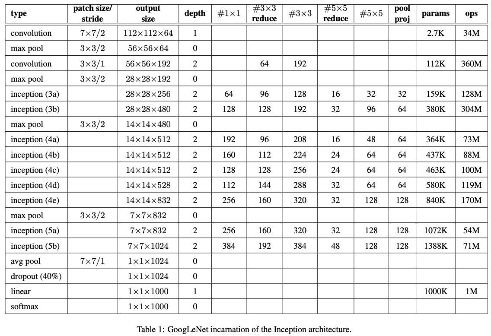
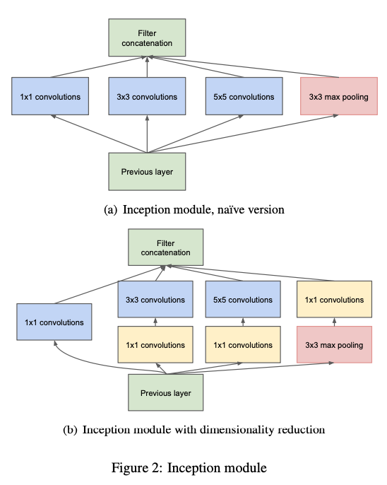

## GoogLeNet

CNN 모델 성능 향상을 위해 가장 직접적인 방법이 네트워크의 깊이를 늘리는 방법이다. 하지만 네트워크가 깊어지면 파라미터 수와 연산량이 많아지고 overfitting 문제에 노출될 수 있다. 따라서, 이러한 문제를 해결하기 위해 **Szegedt et al.** 은 네트워크의 구조적 변화가 필요하다고 생각했고, Inception 모듈로 구성된 GoogLeNet으로 문제를 해결했다. 


### GoogLeNet Architecture

<center></center>


<center></center>


GoogLeNet은 22 레이어 층으로 구성되어 있고, 총 3개의 특징이 있다

- 1 x 1 Filter Conv 
- Inception Module
- Auxiliary Classifier

#### 1 x 1 Filter Conv

1 x 1 필터는 차원 축소, 비선형성의 증가, 그리고 계산량 감소를 시킬 수 있다는 장점이 있다. GoogLeNet에서 1 x 1 필터를 Feature Map 차원의 개수를 줄이는 목적으로 사용한다. 예를 들어, 11 x 11 x 300 Feature Map이 있다고 가정해보자. Feature Map에 30개의 5 x 5 필터로 Convolution을 적용하면 11 x 11 x 30 Feature Map이 생성된다 (Stride = 1, Padding = 0). 이때 필요한 연산량은 11 x 11 x 30 x 5 x 5 x 300 = 27225000 이 된다. 

이번에는 11 x 11 x 300 Feature Map에 먼저 5개의 1 x 1 필터를 적용한 뒤, 30개의 5 x 5 필터를 적용해보자. 그러면  11 x 11 x 5 Feature Map이 생성되고, 이 Feature Map에 5 x 5 필터를 적용해주면 사이즈가 11 x 11 x 30인 Feature Map이 생성된다. 그러면 연산량은 얼마일까? 1 x 1 필터를 적용했을 때의 연산량은 11 * 11 * 300 * 1 * 1 * 5 = 181500이고, 5 x 5 필터를 적용했을 때의 연산량은 11 * 11 * 5 * 5 * 5 * 30 = 21780 이다. 따라서 총 연산량은 181500 + 21780 = 203280 이다. 1 x 1 필터를 중간에 사용했을 때  더 적은 연산량을 가짐을 확인할 수 있다. 연산량을 줄일 수 있다는 점은 네트워크를 더 깊이 만들 수 있게 도와준다는 점에서 중요하다.

#### Inception Module

<center></center>

GoogLeNet은 총 9개의 Inception Module 을 사용하고 있다. GoogLeNet에서 사용된 모듈은 1x1 Conv가 포함된 (b) 모델이다. 위에서 설명했듯이 1x1 필터로 Conv 하면 Feature Map 의 차원의 개수를 줄여줄 수 있다. 1x1 필터를 제외한 버전을 살펴보면, 이전 층에서 생성된 Feature Map을 1x1 필터, 3x3 필터, 5x5 필터, 3x3 Max Pooling 결과 얻은 Feature Map들을 모두 함께 쌓아준다. 

#### Auxiliary Classifier

신경망의 깊이가 깊어질 수록 vanishing gradient 문제가 발생한다. Vanishing Gradient 문제란 back propagation 하는 과정에서 가중치를 업데이터하면서 gradient가 점점 작아져서 0이 되어버린 것을 의미한다. 따라서 신경망이 제대로 학습되지 않을 수 있다.

Auxiliary classifier는 학습시에만 사용하고 inference 할 때 GoogLeNet 중간에 있는 2개의 auxiliary classifier를 모두 제거해야 한다. 

### GooLeNet Tensorflow 실습

```python
import tensorflow as tf
from tensorflow.keras.datasets import mnist
from tensorflow.keras import layers, Sequential, Model

class Inception(layers.Layer):
    def __init__(self, n1x1, n3x3_reduce, n3x3, n5x5_reduce, n5x5, pool_proj):
        super(Inception, self).__init__()

        self.b1 = Sequential([
            layers.Conv2D(n1x1, (1, 1)),
            layers.BatchNormalization(),
            layers.ReLU()
        ])
        self.b2 = Sequential([
            layers.Conv2D(n3x3_reduce, (1, 1)),
            layers.BatchNormalization(),
            layers.ReLU(),
            layers.Conv2D(n3x3, (3, 3), padding='same'),
            layers.BatchNormalization(),
            layers.ReLU()
        ])
        self.b3 = Sequential([
            layers.Conv2D(n5x5_reduce, (1, 1)),
            layers.BatchNormalization(),
            layers.ReLU(),
            layers.Conv2D(n5x5, (3, 3), padding='same'),
            layers.BatchNormalization(),
            layers.ReLU(),
            layers.Conv2D(n5x5, (3, 3), padding='same'),
            layers.BatchNormalization(),
            layers.ReLU(),
        ])
        self.b4 = Sequential([
            layers.MaxPool2D((3, 3), 1, padding='same'),
            layers.Conv2D(pool_proj, (1, 1)),
            layers.BatchNormalization(),
            layers.ReLU(),
        ])

    def call(self, x):
        x = tf.concat([self.b1(x), self.b2(x), self.b3(x), self.b4(x)], axis=3)
        return x


class GoogleNet(Model):
    def __init__(self, num_classes, input_shape=(28, 28, 1)):
        super(GoogleNet, self).__init__()
        self.layer1 = Sequential([
            layers.Input(input_shape),
            layers.Conv2D(192, (3, 3), padding='same'),
            layers.BatchNormalization(),
            layers.ReLU()
        ])
        self.layer2 = Sequential([
            Inception(64, 96, 128, 16, 32, 32),
            Inception(128, 128, 192, 32, 96, 64),
            layers.MaxPool2D((3, 3), 2, padding='same'),
        ])
        self.layer3 = Sequential([
            Inception(192, 96, 208, 16, 48, 64),
            Inception(160, 112, 224, 24, 64, 64),
            Inception(128, 128, 256, 24, 64, 64),
            Inception(112, 144, 288, 32, 64, 64),
            Inception(256, 160, 320, 32, 128, 128),
            layers.MaxPool2D((3, 3), 2, padding='same'),
        ])
        self.layer4 = Sequential([
            Inception(256, 160, 320, 32, 128, 128),
            Inception(384, 192, 384, 48, 128, 128)
        ])
        self.layer5 = Sequential([
            layers.GlobalAveragePooling2D(),
            layers.Dropout(0.4),
        ])
        self.fc = layers.Dense(num_classes, activation='softmax')

    def call(self, inputs, training=False):
        x = self.layer1(inputs, training=training)
        x = self.layer2(x, training=training)
        x = self.layer3(x, training=training)
        x = self.layer4(x, training=training)
        x = self.layer5(x, training=training)
        x = tf.reshape(x, (x.shape[0], -1))
        x = self.fc(x)
        return x
    
(x_train, y_train), (x_test, y_test) = mnist.load_data()
x_train = x_train / 255.
x_test = x_test / 255.
x_train = x_train[:,:,:,tf.newaxis]
x_test = x_test[:,:,:,tf.newaxis]
# print(x_train.shape)
model = GoogleNet(10)
model.compile(optimizer='adam', loss='sparse_categorical_crossentropy', metrics=['accuracy'])
model.fit(x_train, y_train, epochs=5)
model.evaluate(x_test, y_test)

```


#### Reference:

- https://github.com/marload/ConvNets-TensorFlow2/blob/master/models/GoogLeNet.py
- https://bskyvision.com/
- https://arxiv.org/abs/1409.4842
