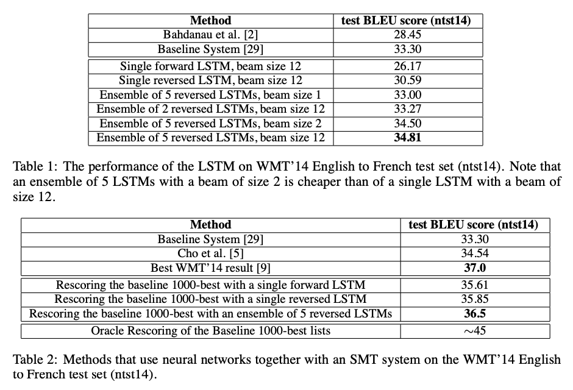
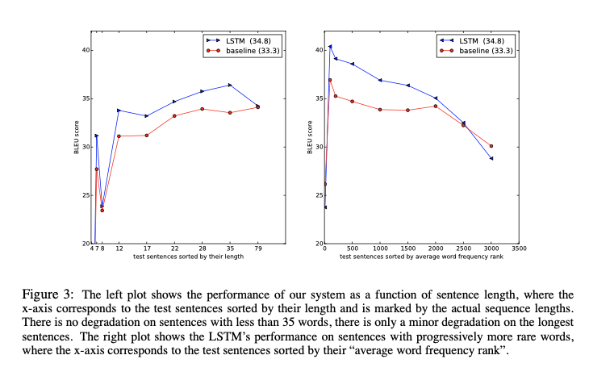

### Introduction

딥러닝 기술이 음성인식, 기계번역 등의 문제를 풀 수 있는 실마리를 제공하고 있지만, 입력 데이터와 출력 데이터의 길이가 고정되어야 한다는 한계가 있다. 본 논문에서는 LSTM 기반의 Encoder-Decoder 모델에 고정된 길이의 입력 데이터를 넣어주고, 가변 길이의 출력 데이터를 생성해 번역 문제를 풀고자 했다.

### Seq2Seq

LSTM의 목표는 입력 데이터에 대한 출력 데이터에 대한 조건부 확률을 아래 식과 같이 평가하는 것이다. LSTM은 우선 입력 데이터에 대하여 고정된 차원의 **context vector**를 연산하고, 아래 수식으로 연산되는 확률을 계산한다. 이때 $p(y_{t}\|v,y_1,y_2,...,y_{t-1})$  분포는 단어에 대한 softmax에 해당된다.

$$
p(y_1,...,y_{T^{'}}| x_{1}, ..., x_{T}) = \prod p(y_t|v, y_{1}, ...,y_{t-1})
$$

앞서 언급했다시피 Seq2Seq은 입력 데이터를 위한 Encoder와 출력 데이터를 위한 Decoder를 사용한다. Encoder는 입력 데이터의 단어들을 순차적으로 입력받아서 context vector 만든다. 입력 데이터의 정보가 context vector로 모두 압축되면 Encoder는 context vector를 Decoder로 넣어주고, Decoder는 번역된 단어를 한 개씩 순차적으로 출력하게 된다. 

본 논문에서는 입력 데이터를 역순으로 배치한 후 모델에 넣어줬다. 입력 문장 데이터의 시작점과 출력 문장 데이터의 시작점이 멀기 때문에 입력 데이터를 거꾸로 넣어줌으로써 minimal time lag 효과를 절감했다.

### Experiment

- **데이터셋**: WMT 14 English to French 데이터중 일부 선택해 사용했으며, 일반적인 neural language model은 각 단어의 벡터 표현에 의존적이기 때문에 두 언어에 대해 고정된 크기의 단어 사전을 사용했다. 단어 사전에 없는 모든 out-of-vocabulary word는 UNK 토큰으로 처리했다.

- **모델 가중치**: -0.08 ~ 0.08 uniform distribution

- SGD without momentum (learning rate=0.7, epoch 5 이후 매 epoch 마다 lr 절반으로 만듦) 

- 4개의 LSTM 레이어 사용

  

  

#### Encoder-Decoder Tensorflow 실습

https://wikidocs.net/24996

#### Reference:

- https://arxiv.org/abs/1409.3215
- https://wikidocs.net/24996
- https://coshin.tistory.com/47

