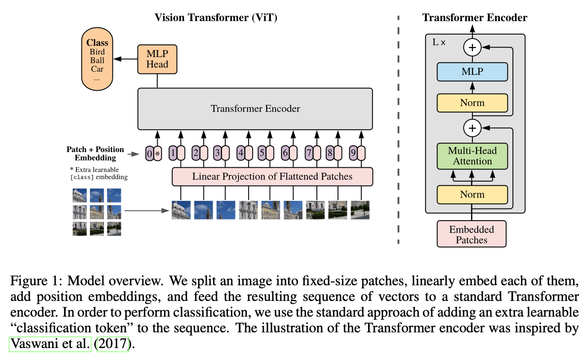
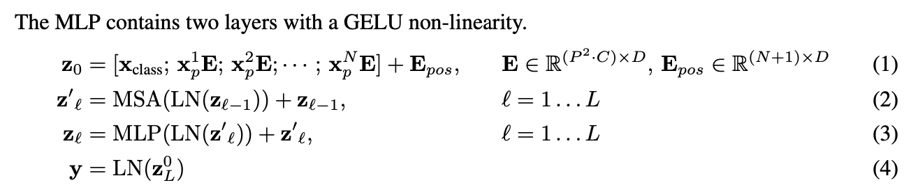
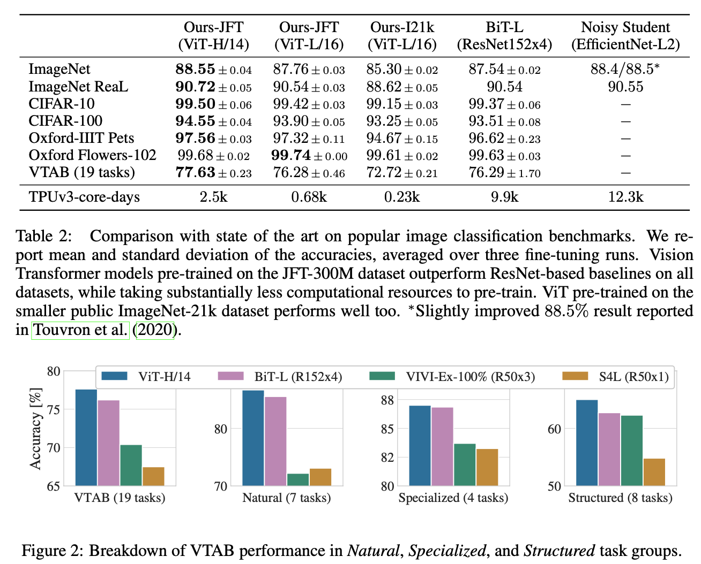

### Introduction

Attention 계열 구조는 자연어 처리분야에 많이 사용되어 왔다. 하지만 비전 분야에서는 CNN 계열 모델이 우세하게 사용되고 있다. 본 논문에서는 Transformer를 이미지 분류 문제에 적용한 연구 실험을 기술했다.  

### Model Architecture


<center></center>

<br/>

전체적인 ViT 모델의 구조는 '**All You Need Is Attention**' 논문에서 나오는 Transformer Encoder 구조와 비슷하다. 다만 텍스트 형식의 데이터를 사용하지 않고 여러 이미지 패치를 사용한다. 본 논문에서는 $(H, W, C)$ 크기의 이미지를 $N$ 개의$(P, P)$ 패치로 자른 후, 각 패치를 $1D$ sequence 형태인 $P^2 \cdot C$ 차원의 vector로 만든다. 그리고 BERT의 $[class]$ 토큰과 비슷하게, classification token을 Position Embedding[0]에 더해준 것을 Position Embedding[1:] 과 Patch Embedding을 더해준 것에 concatenate 해준다. 저자는 2D-aware position embeddings도 사용해봤는데 성능 향상에 도움되지 않았다고 한다. 

그리고 Transformer Encoder에 Patch + Position Embedding (+ [class] embedding) 값을 입력데이터로 넣어준다. 최종적으로 Linear연산을 통해 classification을 하게 된다. 여기서  Transformer Encoder는 Normalization이 맨 앞으로 온 것을 빼면 똑같은 구조를 사용한다. 

<center></center>

### Result

<center></center>


#### ViT Tensorflow 실습 코드

**참고**: https://dzlab.github.io/notebooks/tensorflow/vision/classification/2021/10/01/vision_transformer.html

```python
import tensorflow as tf
from tensorflow.keras.layers import Layer, Dense, Dropout, LayerNormalization, MultiHeadAttention, Add
from tensorflow.keras.layers import Input, Embedding, Concatenate
from tensorflow.keras.models import Model, Sequential

class Patches(Layer): 
    # From Keras Examples
    def __init__(self, patch_size):
        super(Patches, self).__init__()
        self.patch_size = patch_size

    def call(self, images):
        batch_size = tf.shape(images)[0]
        patches = tf.image.extract_patches(
            images=images,
            sizes=[1, self.patch_size, self.patch_size, 1],
            strides=[1, self.patch_size, self.patch_size, 1],
            rates=[1, 1, 1, 1],
            padding="VALID",
        )
        patch_dims = patches.shape[-1]
        patches = tf.reshape(patches, [batch_size, -1, patch_dims])
        # print(patches.shape)
        return patches

def mlp_head(x, config):
    x = Dense(config["mlp_head_dim"] * 2, activation="gelu")(x)
    x = Dropout(config["dropout_rate"])(x)
    x = Dense(config["mlp_head_dim"])(x)
    x = Dropout(config["dropout_rate"])(x)
    return x

def transformer_encoder(x, config):
    skip_connection_1 = x
    x = LayerNormalization()(x)
    x = MultiHeadAttention(num_heads=config["num_heads"], key_dim=config["embedding_dim"])(x, x)
    x = Add()([x, skip_connection_1])

    skip_connection_2 = x
    x = LayerNormalization()(x)
    x = mlp_head(x, config)
    x = Add()([x, skip_connection_2])

    return x

class PatchEncoder(Layer):
    def __init__(self):
        super(PatchEncoder, self).__init__()
        self.num_patches = config["num_patches"]
        self.projection_dim = config["embedding_dim"]
        w_init = tf.random_normal_initializer()
        class_token = w_init(shape=(1, self.projection_dim), dtype="float32")
        self.class_token = tf.Variable(initial_value=class_token, trainable=True)
        self.projection = Dense(units=self.projection_dim)
        self.position_embedding = Embedding(input_dim=self.num_patches+1, output_dim=self.projection_dim)

    def call(self, patch):
        batch = tf.shape(patch)[0]
        # reshape the class token embedins
        class_token = tf.tile(self.class_token, multiples = (batch, 1))
        class_token = tf.reshape(class_token, (batch, 1, self.projection_dim))
        # calculate patches embeddings
        patches_embedding = self.projection(patch)
        patches_embedding = tf.concat([class_token, patches_embedding], 1)
        # calcualte positional embeddings
        positions = tf.range(start=0, limit=self.num_patches+1, delta=1)
        positions_embed = self.position_embedding(positions)
        # add both embeddings
        encoded = patches_embedding + positions_embed
        return encoded

def ViT(config):
    # Inputs and Embedding
    input_shape = (config["img_size"], config["img_size"], config["num_channels"])
    inputs = Input(input_shape)
    p = Patches(config['patch_size'])(inputs)
    x = PatchEncoder()(p)  
    # Encoder
    for _ in range(config["num_layers"]):
        x = transformer_encoder(x, config)

    # Classification head
    x = LayerNormalization()(x)
    x = x[:, 0, :]
    x = Dense(config["num_classes"], activation = "softmax")(x)

    model = Model(inputs, x)
    return model


if __name__ == "__main__":
    config = {}
    config["embedding_dim"] = 64
    config["mlp_head_dim"] = 64
    config["dropout_rate"] = 0.1
    config["num_heads"] = 4
    config["num_classes"] = 10
    config["num_patches"] = 256    
    config["num_layers"] = 8    
    config["img_size"] = 256
    config["patch_size"] = 16
    config["num_channels"] = 3
    config["num_classes"] = 10

    model = ViT(config)
    img = tf.random.normal(shape=[1, config["img_size"], config["img_size"] , 3])
    preds = model(img)
    print(preds)
```
