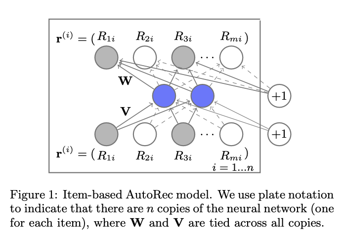
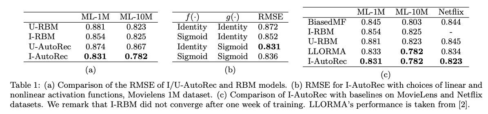

### AutoRec 모델

<center></center>

<br/>

AutoRec 모델은 Auto-Encoder 구조를 사용하고, 사용자 또는 아이템중 하나로Latent Feature를 만들어 Rating Matrix Completion을 수행한다. 본 논문에서는 아이템을 임베딩하는 모델을 **I**-AutoRec, 사용자를 임베딩하는 모델을 **U**-AutoRec 라고 부른다. 

사용자(**m 명**)-아이템 (**n 개**) 평점 행렬 $R \in \mathbb{R}^{m \times n}$ 이 있다고 가정한다. AutoRec 은 입력값 $\mathbf{r^{u}} \text{ or } \mathbf{r^{i}}\in \mathbb{R}^{d}$ 를 받아, 이를 복원하는 $h(\mathbf{r^{z}};\theta)$ 를 다음과 같이 정의한다. 

$$
h(\mathbf{r^{z}}; \theta) = f(\mathbf{W} \cdot g(\mathbf{Vr^{z}} + \boldsymbol{\mu}) + \mathbf{b})
\\
\text{where z could be either be } \mathbf{u} \text{ or } \mathbf{i}
$$

위 식(1)에서 $f(\cdot)$ 과 $g(\cdot)$ 는 각각 decoder와 encoder의 활성화 함수이다. 본 논문에서는 **I**-AutoRec를 사용했을 때, identify function을 encoder의 활성화 함수로, sigmoid function을 decoder의 활성화 함수로 사용했을 때 성능 (RMSE)이 가장 좋았다고 한다. 그리고 마지막으로 AutoRec 에서는 다음과 같은 목적함수를 사용한다. 여기서 목적함수를 계산할 때 **observed ratings** $\mathcal{\{O\}}$만 고려한다는 것이다. 

$$
\min_\theta \sum^n_{z=1} \| \mathbf{r}^{(z)} - h(\mathbf{r}^{(z)}; \theta) \|^2_\mathcal{O} + \frac{\lambda}{2} \left( \| \mathbf{W}_F^2 \| + \| \mathbf{V} \|^2_F \right) 
$$

### Result

<center></center>


### AutoRec Tensorflow Implementation

```python
import tensorflow as tf
from tensorflow.keras.layers import Dense, Input, Layer
from tensorflow.keras import Model, Sequential, regularizers, optimizers, metrics

from zipfile import ZipFile
from pathlib import Path
import pandas as pd
import numpy as np
from sklearn.model_selection import train_test_split

class Encoder(Layer):
    def __init__(self, num_hidden):
        super(Encoder, self).__init__()
        self.n_dims = num_hidden
        self.encoder_layer = Dense(self.n_dims, activation = None, kernel_regularizer=regularizers.l2(0.01))
    
    @tf.function
    def call(self, inputs):
        return self.encoder_layer(inputs)
    
class Decoder(Layer):
    def __init__(self, num_reconstruction):
        super(Decoder, self).__init__()
        self.n_dims = num_reconstruction
        self.decoder_layer = Dense(self.n_dims, activation = 'sigmoid')
        # self.decoder_layer = Dense(self.n_dims)
        
    @tf.function
    def call(self, inputs):
        x = self.decoder_layer(inputs)
        return x

class AutoRec(Model):
    def __init__(self, num_hidden, num_reconstruction):
        super(AutoRec, self).__init__()
        self.encoder = Encoder(num_hidden)
        self.decoder = Decoder(num_reconstruction)

    @tf.function       
    def call(self, inputs):
        x = self.encoder(inputs)
        x = self.decoder(x)
        return x
    
def ObservedOnlyMSELoss(y_true, y_pred):
    # 참고: https://supkoon.tistory.com/36
    mask = y_true != 0
    mask_float = tf.cast(mask, tf.float32)
    masked_error = tf.reduce_mean(tf.pow(tf.subtract(mask_float * y_pred,y_true),2))
    return masked_error


movielens_data_file_url = (
    "http://files.grouplens.org/datasets/movielens/ml-latest-small.zip"
)
movielens_zipped_file = tf.keras.utils.get_file(
    "ml-latest-small.zip", movielens_data_file_url, extract=False
)
keras_datasets_path = Path(movielens_zipped_file).parents[0]
movielens_dir = keras_datasets_path / "ml-latest-small"

# Only extract the data the first time the script is run.
if not movielens_dir.exists():
    with ZipFile(movielens_zipped_file, "r")as zip:
        # Extract files
        print("Extracting all the files now...")
        zip.extractall(path=keras_datasets_path)
        print("Done!")

class dataloader():
    # 참고: https://github.com/supkoon/AutoRec-tf/blob/master/AutoRec.py
    def __init__(self,test_size, path = movielens_dir / "ratings.csv"):
        self.test_size = test_size
        self.ratings_df = pd.read_csv(path)
        self.ratings_df.columns = ["userId","movieId","rating","timestamp"]
        self.num_user = len(self.ratings_df.userId.unique())
        self.num_item = len(self.ratings_df.movieId.unique())
        
    def make_user_autorec_input(self):
        user_item_df = self.ratings_df.pivot_table(values="rating", index="userId", columns="movieId")
        user_item_df.fillna(0,inplace=True)
        self.user_item_df = np.array(user_item_df)
        train_df,test_df = train_test_split(self.user_item_df, test_size =self.test_size)
        return train_df,test_df

    def make_item_autorec_input(self):
        item_user_df = self.ratings_df.pivot_table(values="rating", index="movieId", columns="userId")
        item_user_df.fillna(0,inplace=True)
        self.item_user_df = np.array(item_user_df)
        train_df,test_df = train_test_split(self.item_user_df, test_size =self.test_size)
        return train_df,test_df
    
dataloader = dataloader(0.1)   
train_data, test_data = dataloader.make_item_autorec_input()
num_features = dataloader.num_user

model = AutoRec(num_features // 2, num_features)
model.compile(optimizer=optimizers.SGD(learning_rate=0.001), loss= ObservedOnlyMSELoss, metrics = [metrics.RootMeanSquaredError()])
model.fit(train_data, train_data, batch_size=16, epochs=10, validation_data=(test_data, test_data))
```


#### Reference:

- http://users.cecs.anu.edu.au/~u5098633/papers/www15.pdf
- https://keras.io/examples/structured_data/collaborative_filtering_movielens/
