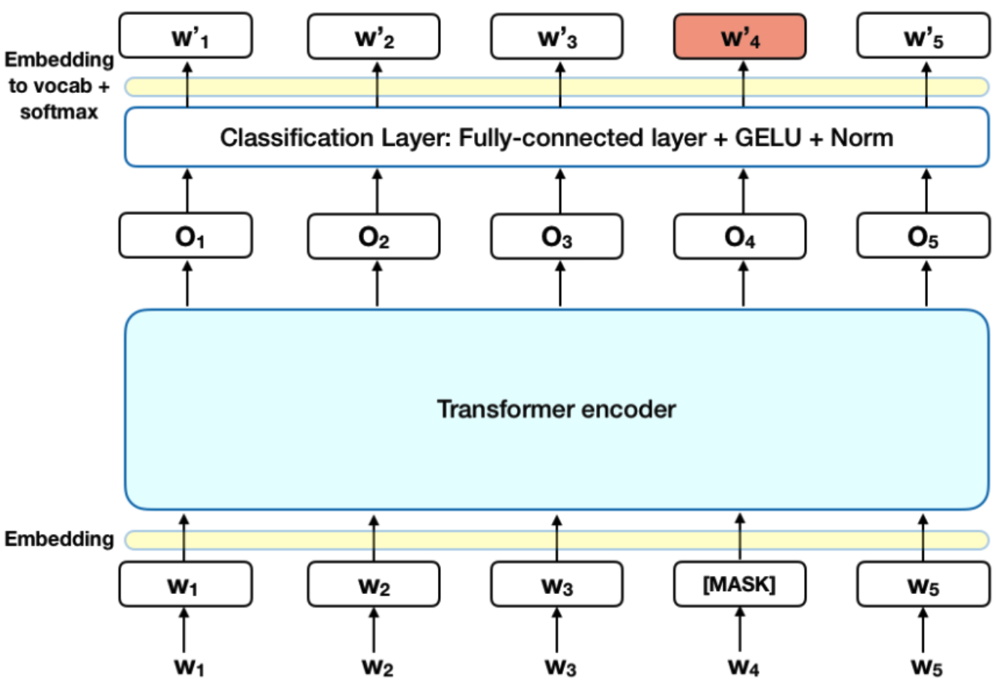
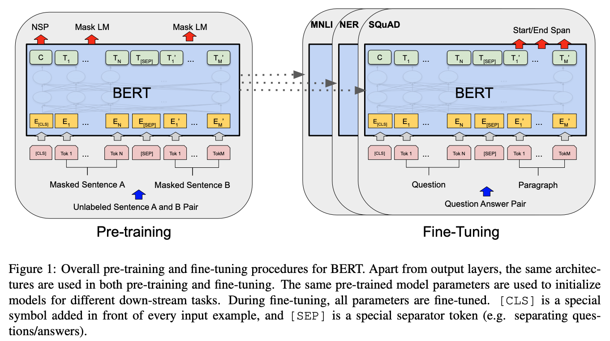
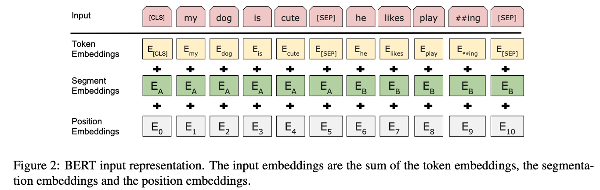
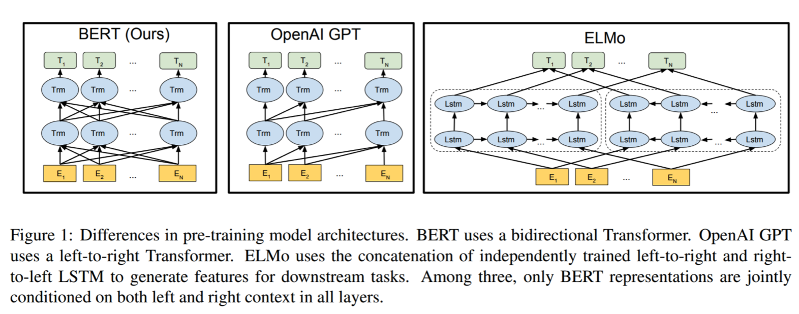
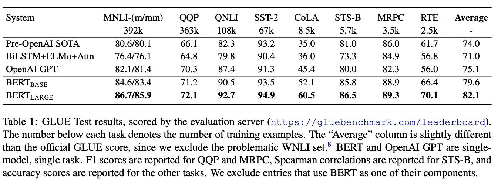

### Introduction 

BERT(**B**idirectional **E**ncoder **R**epresentations from **T**ransformers)는 2018년에 구글 리서치 팀에 의해 공개된 Language Representation 모델이다. 이름에서 알 수 있듯이 BERT 모델은 양방향성 (**Bidirectional**) 특성을 갖고 있다. 그렇다면 양방형 문맥을 고려한다는 것에 무슨 의미이고, 어떤 장점이 있을까? 양방향으로 학습한다는 것은 전체적인 문맥을 파악하기 위함이다. 직관적으로 생각해보면 단방향에서 오는 정보보다 양방향에서 오는 정보가 많기 때문에 정보의 질에 차이가 날 수 밖에 없다. 예를 들어, **"She is eating a bowl of salad"**라는 문장이 있을 때, **"eat"**라는 동사를 정해놓고 **"salad"**를 사용하지 않는다. **"salad"**를 놓고 어떤 액션을 하고 있다는 말을 하고 싶었을 수도 있다. 이렇듯 양방향으로 학습하면 전체적인 문맥을 이해할 수 있다.

### BERT Architecture

<center>  </center>

BERT는 Transformer의 Encoder 부분만 사용한다. BERT는 구조의 크기에 따라 Base와 Large 2가지 유형의 모델로 나눠진다. **BERT-Base** 모델의 Hyperparameter는 $L = 12$, $H = 768$, $A = 12$ 이고 **BERT-Large** 모델의 Hyperparameter는 $L = 24$, $H = 1024$, $A = 16$ 이다.  

- **L** = # Transformer Block
- **H** = # Hidden Layer
- **A** = # Self Attention Head

더하여 BERT는 기존의 자연어처리 사전학습 모델의 문제점을 보완하기 위해 두 가지 unsupervised tasks: (1) Masked language model, (2) next sentence prediction (NSP) 방법을 사용해 학습한다.

<center>  </center>

#### Masked Language Model (MLM)

MLM 는 [Mask]된 단어를 예측하면서 전체적인 문맥을 파악하는 능력을 학습한다. MLM 수행 과정은 다음과 같다. 우선 입력 데이터의 토큰 중 15%는 무작위로 선택한다. 선택된 토큰중 80% [Mask] 토큰으로, 10%는 랜덤한 단어로 바뀐다. 그리고 나머지 10%는 오리지널한 단어 그 상태 그대로 유지된다. 

#### Next Sentence Prediction (NSP)

NSP는 두 번째 문장이 첫 번째 문장 다음으로 오는 문장인지 맞추는 문제를 푼다. 첫 번째 문장과 두 번째 문장은 [SEP]로 구분한다. 두 번째 문장이 첫 번째 문장을 연속하는지는 50% 비율로 참인 문장과, 50%의 랜덤하게 추출된 문장으로 구성해 학습한다. 이 과정을 통해 문맥과 문장의 관계를 학습할 수 있다. 

### BERT Input

<center>  </center>

<br/>

위 그림처럼 세 가지 임베딩(**Token**, **Segment**, **Position**)을 사용해서 문장을 표현한다.

- **Token Embedding**: 모든 문장의 시작을 표현하는 특수 토큰 [CLS], 문장을 구분하기 위한 특수 토큰 [SEP], 그리고 단어별 임베딩으로 구성
- **Segment Embedding**: 문장을 구분하기 위한 임베딩
- **Position Embedding**: Transformer 구조에서 사용된 토큰의 위치를  알려주는 임베딩

이 세 가지 임베딩을 더한 임베딩을 입력 데이터로 사용하게 된다.

### BERT, GPT, ELMo Comparison 

<center>  </center>

#### Results

GLUE 데이터셋에 대한 BERT 실험 결과

<center>  </center>


#### BERT Tensorflow Code Example

https://www.tensorflow.org/text/tutorials/classify_text_with_bert

```python
# !pip install -q -U "tensorflow-text==2.8.*"
# !pip install -q tf-models-official==2.7.0
import os
import shutil

import tensorflow as tf
import tensorflow_hub as hub
import tensorflow_text as text
from official.nlp import optimization  # to create AdamW optimizer

import matplotlib.pyplot as plt

tf.get_logger().setLevel('ERROR')

url = 'https://ai.stanford.edu/~amaas/data/sentiment/aclImdb_v1.tar.gz'

dataset = tf.keras.utils.get_file('aclImdb_v1.tar.gz', url,
                                  untar=True, cache_dir='.',
                                  cache_subdir='')

dataset_dir = os.path.join(os.path.dirname(dataset), 'aclImdb')

train_dir = os.path.join(dataset_dir, 'train')

# remove unused folders to make it easier to load the data
remove_dir = os.path.join(train_dir, 'unsup')
shutil.rmtree(remove_dir)

AUTOTUNE = tf.data.AUTOTUNE
batch_size = 32
seed = 42

raw_train_ds = tf.keras.utils.text_dataset_from_directory(
    'aclImdb/train',
    batch_size=batch_size,
    validation_split=0.2,
    subset='training',
    seed=seed)

class_names = raw_train_ds.class_names
train_ds = raw_train_ds.cache().prefetch(buffer_size=AUTOTUNE)

val_ds = tf.keras.utils.text_dataset_from_directory(
    'aclImdb/train',
    batch_size=batch_size,
    validation_split=0.2,
    subset='validation',
    seed=seed)

val_ds = val_ds.cache().prefetch(buffer_size=AUTOTUNE)

test_ds = tf.keras.utils.text_dataset_from_directory(
    'aclImdb/test',
    batch_size=batch_size)

test_ds = test_ds.cache().prefetch(buffer_size=AUTOTUNE)

tfhub_handle_encoder = 'https://tfhub.dev/tensorflow/small_bert/bert_en_uncased_L-4_H-512_A-8/1'
tfhub_handle_preprocess = 'https://tfhub.dev/tensorflow/bert_en_uncased_preprocess/3'
bert_preprocess_model = hub.KerasLayer(tfhub_handle_preprocess)
bert_model = hub.KerasLayer(tfhub_handle_encoder)

def build_classifier_model():
  text_input = tf.keras.layers.Input(shape=(), dtype=tf.string, name='text')
  preprocessing_layer = hub.KerasLayer(tfhub_handle_preprocess, name='preprocessing')
  encoder_inputs = preprocessing_layer(text_input)
  encoder = hub.KerasLayer(tfhub_handle_encoder, trainable=True, name='BERT_encoder')
  outputs = encoder(encoder_inputs)
  net = outputs['pooled_output'] # CLS
  net = tf.keras.layers.Dropout(0.1)(net)
  net = tf.keras.layers.Dense(1, activation=None, name='classifier')(net)
  return tf.keras.Model(text_input, net)

classifier_model = build_classifier_model()
loss = tf.keras.losses.BinaryCrossentropy(from_logits=True)
metrics = tf.metrics.BinaryAccuracy()

epochs = 5
steps_per_epoch = tf.data.experimental.cardinality(train_ds).numpy()
num_train_steps = steps_per_epoch * epochs
num_warmup_steps = int(0.1*num_train_steps)

init_lr = 3e-5
optimizer = optimization.create_optimizer(init_lr=init_lr,
                                          num_train_steps=num_train_steps,
                                          num_warmup_steps=num_warmup_steps,
                                          optimizer_type='adamw')

classifier_model.compile(optimizer=optimizer,
                         loss=loss,
                         metrics=metrics)

history = classifier_model.fit(x=train_ds,
                               validation_data=val_ds,
                               epochs=epochs)

examples = [
    'this is such an amazing movie!',  # this is the same sentence tried earlier
    'The movie was great!',
    'The movie was meh.',
    'The movie was okish.',
    'The movie was terrible...'
]

original_results = tf.sigmoid(classifier_model(tf.constant(examples)))

print('Results from the model in memory:')
print_my_examples(examples, original_results)
```


#### Reference:

- https://towardsdatascience.com/bert-explained-state-of-the-art-language-model-for-nlp-f8b21a9b6270
- https://hwiyong.tistory.com/392
- https://keep-steady.tistory.com/19
