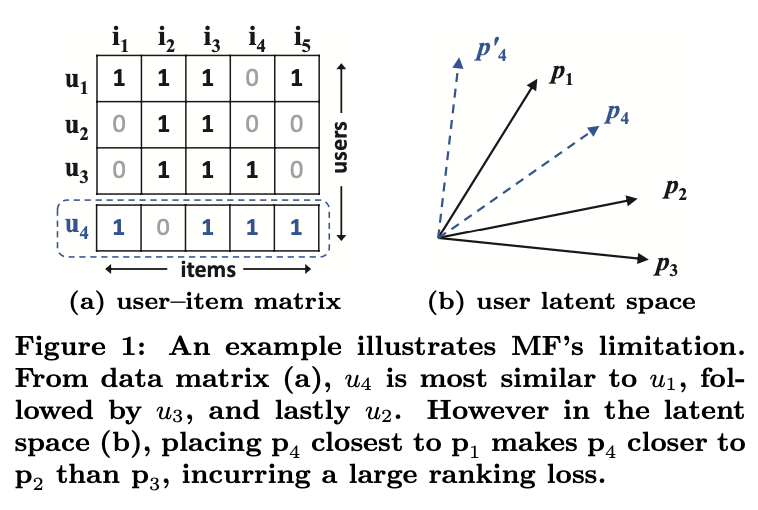

### Introduction

넷플릭스 경진대회의해 알려진 Matrix Factorization은 추천시스템 분야에서 널리 사용되는 방법이다. 이는 사용자와 아이템이 상호작용하는 Latent Matrix을 Inner Product를 통해 사용자의 Latent Matrix과 아이템의 Latent Matrix로 분해한다. 본 논문에서는 Inner Product 기반의 Matrix Factorization은 선형적인 관계만 모델링한다는 한계에 대해 지적하고, 사용자와 아이템간의 관계를 더 잘 표현할 수 있는 신경망 기반의 NeuMF 모델을 제안했다.

### Matrix Factorization 문제점

<center></center>

위 그림(a)은 사용자(row)-아이템(column) 관계를 행렬로 표현하고 있다. 여기서 $y_{u,i}=1$은 **user** $u$ 와 **item** $i$ 간의 상호작용이 있었음을 나타낸다. 상호작용이란 사용자가 아이템을 확인했거나, 구매했다는 등의 implicit 한 정보를 의마한다. 따라서 $y_{u,i}=0$ 은 **user** $u$ 와 **item** $i$ 간의 상호작용이 없었다는 뜻이지, **user** $u$ 가 **item** $i$ 를 선호하지 않는다는 뜻은 아니다. 

Inner Product 기반의 Matrix Factorization에 어떤 문제가 있는지 자카드 유사도(Jaccard Similarity) 를 고려하는 경우를 가정한다.그러면 위 그림(a)와 같은 행렬로부터 다음과 같은 관계가 성립한다고 볼 수 있다. 


$$
s_{23}(0.66) > s_{12}(0.5) > s_{13}(0.4)
$$


즉, **사용자 2와 사용자 3**이 **사용자 1과 사용자 2** 보다 비슷하고, **사용자 1과 사용자 2**이 **사용자 1과 사용자 3** 보다 비슷하다는 뜻이다. 위 그림 (b) 는 이런 관계를 기하학적으로 보여주고 있다. Matrix Factorization 의 한계는 사용자 4가 등장했을 때 발생한다. 사용자 4와 나머지 사용자의 자카드 유사도 관계는 다음과 같다.

$$
s_{41}(0.6) > s_{43}(0.4) > s_{42}(0.2)
$$


하지만 그림 (b)에  $p_4$를 어디에 놔도 $p_3$보다 $p_2$가 더 가깝기 때문에 ranking loss가 커질 수 밖에 없다. 이런 한계는 사용자와 아이템의 관계를 저차원의 공간에 표현 하는 데에서 기인한다. 따라서 본 논문에서는 사용자와 아이템의 상호작용을 더 복잡한 차원에서 표현할 수 있도록 신표현할 수 있도록 신경망을 활용해 해결하고자 했다.

### Neural Collaborative Filtering Framework

<center></center>

본 논문에서 제안한 Neural Collaboraitive Filtering의 General Framework 는 총 4개의 레이어로 구성되었다: (1) **Input Layer**, (2) **Embedding Layers**, (3) **Neural CF Layers**, 그리고 (4) **Output Layers**. 

Input Layer는 각각 사용자($v_u^U$)와 아이템($v_i^I$)을 나타내는 원핫인코디드된 Feature vector로 구성되어 있다. Embedding Layer 에서 Sparse한 이 Feature vector를 Dense한 Latent vector로 바꿔주는 역할을 한다. 임베딩이 된 사용자와 아이템 Latent vector를 concatenation한 vector를 Neural CF Layers에 들어가게 되고 복잡하고 비선형적인 데이터 관계를 학습하게 된다. 마지막으로 Output Layers에서 사용자 $u$와 아이템 $i$가 얼마나 관련 있는지를 나타내는 $\hat{y_{u,i}}$ 값을 계산한다.

#### Generalized Matrix Factorization (GMF)

저자는 **Matrix Factorization** 역시 NCF framework의 특수한 케이스가 됨을 보여주고 이를 GMF라고 한다. Latent Vector $p_u$ ($P^Tv^U_u$), $q_i$ ($Q^Tv^I_i$) 라고 정의했을 때, 첫번째 NCF layer의 mapping function을 다음과 같다.


$$
\phi_1(p_u,q_i) = p_u\odot q_i
$$


이 결과를 output layer에 project한다면 아래와 같이 표현할 수 있다. 여기서 $a_{out}$ 를 identical function으로 가정하고, $h$를 uniform vector **1**로 정의한다면, 기존 Matrix Factorization과 동일해집니다.


$$
\hat{y}_{ui} = a_{out}(h^T(p_u \odot q_i))
$$


GMF란 $a_{out}$ 와 $h$를 아래와 같이 두어 **Matrix Factorization**를 일반화한 모델이다.


$$
a_{out} = \frac{1}{1 + e^{−x}},\ h^T = [h_1 , ... , h_k],
$$


#### Multi-Layer Perceptron (MLP)

GMF의 **fixed/linear** (element-wise product)한 특징으로 인해 사용자와 아이템간의 복잡한 관계를 표현하지 못하고, MLP는 **flexible/non-linear**하기 때문에 복잡한 관계를 표현할 수 있다.


$$
z_1 = \phi_1(p_u,q_i) = \begin{bmatrix}p_u\\q_i\end{bmatrix},\\
\phi_2(z_1) = a_2(W_2^Tz_1+b_2), \\
... \\
\phi_L(z_{L-1}) = a_L(W_L^Tz_{L-1}+b_L), \\
\hat{y}_{ui} = \sigma(h^T\phi_L(Z_{L-1}))
$$


#### Fusion of GMF and MLP

본 논문에서는 GMF와 MLP를 통합한 모델은 제안한다. 


$$
\phi^{GMF} = p_{u}^{G} \odot q_{i}^{G}, \\
\phi^{MLP} = a_{L}(W_{L}^{T}(a_{L-1}(...a_{2}(W_{2}^{T} \begin{bmatrix} p_{u}^{M} \\ q_{i}^{M} \end{bmatrix}+b_{2})...))+b_{L}), \\
\hat{y}_{u,i} = \sigma(h^{T} \begin{bmatrix}\phi^{GMF} \\ \phi^{MLP} \end{bmatrix})
$$


$p^G_u$와 $q^G_i$는 GMF를 위한 embedding이고 $p^M_u$와 $q^M_i$는 MLP를 위한 embedding이다. 그리고 $a_L$ 활성화 함수로 ReLU를 사용했다고 한다. 


#### Result

<center></center>


### NMF 모델 Tensorflow 실습

```python
class NeuMF(Model):
    def __init__(self, user_num, item_num, latent_features = 8, alpha = 0.5):
        super(NeuMF, self).__init__()
        self.latent_features = latent_features
        self.user_num = user_num
        self.item_num = item_num
        self.alpha = alpha
        
        self.gmf_embedding_user = Embedding(input_dim = self.user_num, output_dim = self.latent_features)
        self.gmf_embedding_item = Embedding(input_dim = self.item_num, output_dim = self.latent_features)
        self.mlp_embedding_user = Embedding(input_dim = self.user_num, output_dim = 32)
        self.mlp_embedding_item = Embedding(input_dim = self.item_num, output_dim = 32)
        
        self.mlp_vector1 = Dense(units=16, activation='relu')
        self.mlp_vector2 = Dense(units=8, activation='relu')
        
        self.prediction = Dense(1, activation='sigmoid')
        
    def call(self, inputs):
        user_input, item_input = inputs

        # Embedding layer
        gmf_embedding_user = self.gmf_embedding_user(user_input)
        gmf_embedding_item = self.gmf_embedding_user(item_input)
        mlp_embedding_user = self.gmf_embedding_user(user_input)
        mlp_embedding_item = self.gmf_embedding_user(item_input)

        # GMF part
        gmf_user_latent = Flatten()(gmf_embedding_user)
        gmf_item_latent = Flatten()(gmf_embedding_item)
        gmf_vector = Multiply()([gmf_user_latent, gmf_item_latent]) 
        
        # MLP part 
        mlp_user_latent = Flatten()(mlp_embedding_user)
        mlp_item_latent = Flatten()(mlp_embedding_item)
        mlp_vector = Concatenate()([mlp_user_latent, mlp_item_latent])
        
        mlp_vector1 = self.mlp_vector1(mlp_vector)
        mlp_vector2 = self.mlp_vector2(mlp_vector1)
        
        # Concatenate GMF and MLP parts
        gmf_vector = Lambda(lambda x: x * self.alpha)(gmf_vector)
        mlp_vector2 = Lambda(lambda x : x * (1-self.alpha))(mlp_vector2)
        prediction_vector = Concatenate()([gmf_vector, mlp_vector2])
        
        # Prediction Layer
        return self.prediction(prediction_vector)

def train_instances(uids, iids, num_neg, num_items):
    user_input, item_input, labels = [],[],[]
    zipped = set(zip(uids, iids)) # train (user, item) 세트

    for (u, i) in zip(uids, iids):

        # pos item
        user_input.append(u) 
        item_input.append(i)  
        labels.append(1)   

        # neg item
        for t in range(num_neg):

            j = np.random.randint(num_items) 
            while (u, j) in zipped: 
                j = np.random.randint(num_items) 

            user_input.append(u)  # [u1, u1,  u1,  ...]
            item_input.append(j)  # [pos_i, neg_j1, neg_j2, ...]
            labels.append(0)      # [1, 0,  0,  ...]

    user_input = np.array(user_input).reshape(-1, 1)
    item_input = np.array(item_input).reshape(-1, 1)
    labels = np.array(labels).reshape(-1, 1)
    return user_input, item_input, labels

num_neg = 4
# train_user_ids: 학습 데이터의 유저 아이디 (unique)
# train_item_ids: 학습 데이터의 아이템 아이디 (unique)
# items: 학습 + 테스트의 아이템 아이디
train_user_ids, train_item_ids, items = load_dataset() # 로드데이터 각자 구현 필요

user_input, item_input, labels = train_instances(train_user_ids, train_item_ids, num_neg, len(items))

model = NeuMF(len(users), len(items)) 
model.compile(optimizer= 'adam', loss='binary_crossentropy')
model.fit([user_input, item_input],labels, batch_size=128, epochs=10, shuffle=True)
```


#### Reference:

- https://github.com/ngduyanhece/neuMF/blob/master/NeuMF.py
- https://leehyejin91.github.io/post-ncf/
- https://supkoon.tistory.com/28
