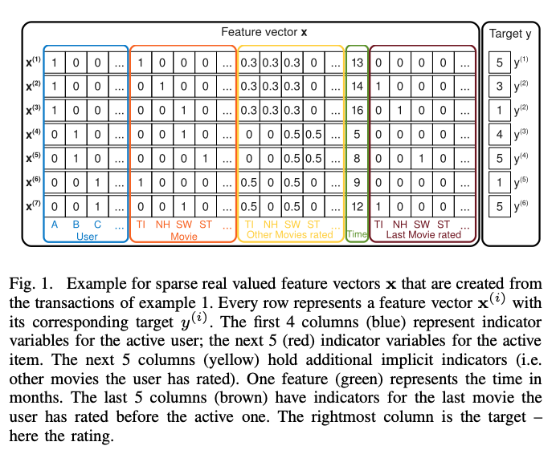
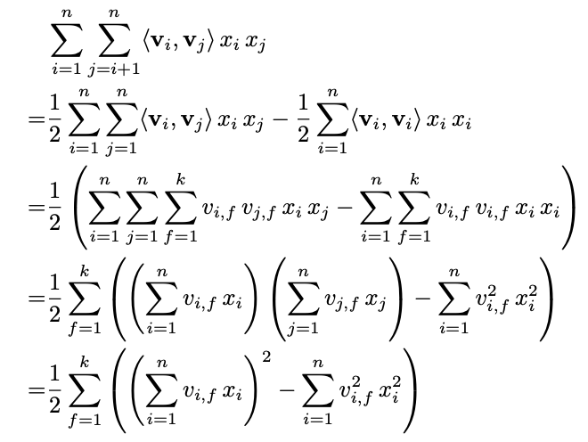

### Introduction

본 논문에서는 희소성이 높은 데이터 환경에서도 realiable parameter를 추정할 수 있는 Factorization Machine (FM) 모델을 소개한다. FM 알고리즘은 Support Vector Machine의 장점과 Factorization Model의 장점만을 결합한 모델이다. 따라서 FM 모델의 장점을 다음과 같이 정리할 수 있다. 

- **Highly Sparse data** = 희소한 데이터 환경에서 파라미터 추정이 가능하다 (Factorization Model's 장점).
- **Linear Complexity** = Feature 개수에 따른 선형 복잡도를 갖는다.
- **General Predictor** = 실수나 정수값을 입력데이터로 넣을 수 있다 (SVM's 장점). 

#### Example: Feature Representation
<center></center>

<br/>

위 그림과 같은 데이터가 있다고 가정해보자. 그림에서의 파란색 영역은 유저를 의미하는 변수이고, 주황색 영역은 아이템(여기서는 영화 이름)을 나타내는 변수이다. 노란색 영역은 사용자가 다른 영화들에 평점을 준 변수이고, 녹색은 1월 2009년 이후 월 단위 시간을 나타낸다. 마지막으로 붉은색 영역은 해당 영화를 평가하기 전에 평가한 영화를 나태내는 변수이다. 그리고 맨 오른쪽 열은 영화에 대한 평점이다.

예를 들어, 평점을 예측하기 위해 Alice(A)와 StarTrek(ST)사이의 상호작용을 estimate한다고 가정해보자. 인수분해된 상호작용 파라미터인 $<V_{A}, V_{ST}>$를 통해 상호작용을 측정할 수 있다. 우선, Bob(B)과 Charlie(C) 모두 StarWars(SW)에 대한 평점을 각자 4점, 5점 주었기 때문에 유사한 Factor Vector $V_B$, $V_C$를 가진다. 이것은 $<V_{B}, V_{SW}>$와 $<V_{C}, V_{SW}>$가 유사하다는 것을 의미한다. 그리고 Alice는 Titanic(TI)에 5점, Charlie는 1점을 주었기 때문에 Alice와 Charlie는 다른 Factor Vector를 가진다. 그리고 Bob이 StarTrek과 StarWars에 유사한 높은 점수 각각 4점, 5점를 주었기 때문에 두 영화의 Factor Vector는 유사한 상호작용을 가질 것이다. 결론을 말하자면, Alice는 StarTrek에 대해 평점을 낮게 줄 가능성이 있으며, 이를 통해 Alice와 StarTrek에 대한 Factor Vector의 내적이 Alice와 StarWars의 Factor Vector의 내적값과 유사하다는 점을 추측할 수 있다.

### Model Equation
degree d=2인 FM 알고리즘 방정식은 다음과 같다.

$$
\hat{y}(x) := w_{0} + \sum_{i=1}^{n} w_{i}x_{i} + \sum_{i=1}^{n}\sum_{j= i + 1}^{n} <v_i,v_j>x_ix_j \\
\text{where the model parameters that have to be estimated are:} \\
w_{0} \in \mathbb{R}, \mathbf{w} \in \mathbb{R}^n, \mathbf{V} \in \mathbb{R}^{n \times k} 
$$

위 식의 첫 번째 항 $w_{0}$은 global bias이다. 두번째 항을 보면 $w_{i}$는 i번째 개별 Feature에 대한 가중치이며, $x_{i}$는 하나의 Feature Vector를 의미한다. 모델링을 통해 개별 Feature의 영향력(w)를 estimate하는 것이라고 볼 수 있다. 하지만, Feature들끼리에 대한 상호작용을 고려할 수 없다는 단점이 있어서 세 번째 항인 $<V_i, V_j>$ 이 추가되었으며 이는 i번째와 j번째 Feature간의 상호작용을 의미한다. 중요한 것은 $w_{i,j}$를 사용하는 것이 아니라 이를 k차원으로 인수분해된 두 vector의 내적를 $<V_i, V_j>$로 표현한 것이다. 이것은 변수간 상호작용의 Latent Vector 이다. 

$$
<v_i, v_j> := \sum_{f = 1}^{k}v_{i,f} \cdot v_{j, f}
$$

$v_i$는 V 내부의 행을 의미하고 k개의 factor를 가진 i번째 변수이며, k는 factorization의 차원이다. 이는 Latent Vector 조합을 모두 고련한다는 것을 의미한다.

Linear Complexity 으로 만드는 식 과정은 다음과 같다.
<center></center>

### FM 알고리즘 Tensorflow

```python
# https://github.com/supkoon/factorization_machine_tf
class FM(keras.Model):
    def __init__(self, n_factor=8, **kwargs):
        super().__init__(**kwargs)

        self.w_0 = tf.Variable([0.0])
        self.w = tf.Variable(tf.zeros(shape=[n]))
        self.v = tf.Variable(tf.random.normal(shape=(n, n_factor)))

    def call(self,inputs):
        degree_1 = tf.math.reduce_sum(tf.multiply(self.w, inputs), axis=1)

        degree_2 = 0.5 * tf.math.reduce_sum(
            tf.math.pow(tf.linalg.matmul(inputs, self.v), 2)
            - tf.linalg.matmul(tf.math.pow(inputs, 2), tf.math.pow(self.v, 2))
            , 1
            , keepdims=False
        )

        predict = tf.math.sigmoid(self.w_0 + degree_1 + degree_2)

        return predict
```

#### Reference:
- https://www.csie.ntu.edu.tw/~b97053/paper/Rendle2010FM.pdf
- https://www.intelligencelabs.tech/c4d971e3-09a5-4e20-9d82-cc623344602d

