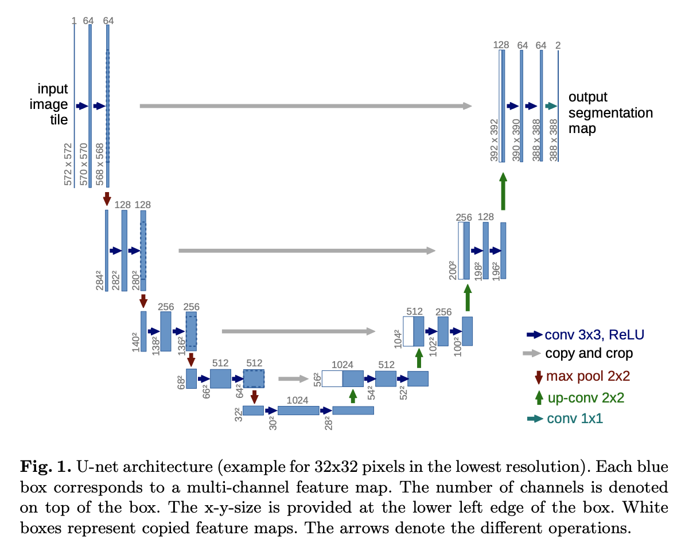
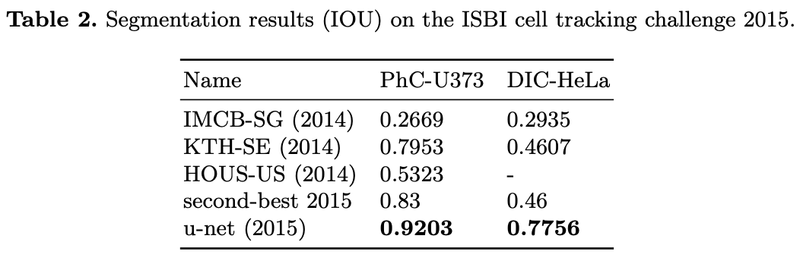

### Introduction

이미지를 수집하고 라벨링은 하는 작업은 고된 과정이다. 특히 컴퓨터 비전에서의 분할 문제는 각 픽셀이 어떤 클래스로 분류되는지 알아야 하기 때문에 구하기가 어렵다. 본 논문에서는 데이터 수가 적어도 분할 문제를 풀 수 있는 U자형 구조 U-Net를 소개한다. 이 네트워크 구조는 **수축 경로** (contracting path) 그리고 **확장 경로** (expanding path)로 크게 나눠진다. U-Net은 contracting path를 통해 context 정보를 구하고, expanding path를 통해 다시 원본 이미지 크기에 segmentation (precise localization) 작업을 수행한다.

### Architecture:

<center></center>

#### Contracting Path
수축 경로는 U-Net 구조에서의 시작 부분(Concave Up, Decreasing)이라고 생각하면 된다. 이미지의 공간해상도를 줄이기 위한 $2 \times 2$ Max Pooling (Stride = 2)과, ReLU 활성화함수를 포함한 두 번의 $3 \times 3$ Conv (Stride = 1, No Padding) 연산을 한다. 즉, $3 \times 3$ Conv (<span style="color:blue">파란색 화살표</span>) $\rightarrow$ ReLU 활성화 함수 $\rightarrow$ $2 \times 2$ Max Pooling (Stride = 2, <span style="color:red">빨간색 화살표</span>)를 각 레벨에서 두 번씩 진행하며, 공간해상도는 줄이고 채널의 개수는 2배로 증가시키는 작업을 반복적으로 진행한다. 

#### Expanding Path
확장 경로는 U-Net 구조에서의 뒷부분(Concave Up, Increasing)에 해당된다. 확장 경로에서는 수축 경로에서와는 다르게 이미의 공간해상도를 증가시키기 위한 연산을 수행한다. 수축 경로에서 추출한 특성맵과 concatenation를 진행한 뒤, ReLU 활성화 함수를 포함한 $2 \times 2$ Up Convolution 적용한다. 즉, Feature Map Concatenation (<span style="color:grey">회색 화살표</span>) $\rightarrow$ 2번의 $2 \times 2$ Up Convolution (<span style="color:green">초록색 화살표</span>) with ReLU를 반복적으로 수행하며 공간해상도는 다시 늘리는 작업을 한다. 

마지막 레이어에서는 $1 \times 1$ Conv filter (<span style="color:LightSeaGreen">청녹색 화살표</span>)를 이용해 클래스의 개수만큼 채널의 개수를 남겨준다.

### Data Augmentation
Data Augmentation은 invariance와 robustness 성질을 학습하기 위한 필수적인 요소이다. 본 논문에서는 Random Elastic Deformation을 사용한 것이 분할 네트워크를 학습하는 데에 있어 Key Concept 역할을 했다고 한다. 이름에서 알 수 있듯이 이 증강 기법은 이미지를 유연하게 변형시켜 흔들림이나 왜곡된 이미지를 잘 구분할 수 있게 만든다. 

### Why U-Net

- 적은 수의 학습 데이터로도 Biomedical Image Segmentation 문제에서 우수한 성능을 보임.
- 수축 경로를 거치면서 Context 정보를 구하고, 확장 경로를 통해 정확한 Localization이 가능하도록 설계됨.
- 파이프라인 네트워크가 없는 End-to-End 구조로 되어 있음. 

### Results

<center></center>
<br/>
<center></center>

### U-Net Tensorflow Implementation

```python
# padding = 'same' is used for convenience
from tensorflow.keras.layers import Conv2D, Activation, Concatenate
from tensorflow.keras.layers import MaxPooling2D, Conv2DTranspose, Input
from tensorflow.keras import Model


def conv_blocks(inputs, num_filters):
    x = Conv2D(num_filters, 3, padding='same')(inputs)
    x = Activation("relu")(x)
    
    x = Conv2D(num_filters, 3, padding='same')(x)
    x = Activation("relu")(x)
    return x

def contracting_block(inputs, num_filters):
    x = conv_blocks(inputs, num_filters)
    p = MaxPooling2D((2, 2))(x)
    return x, p

def expanding_block(inputs, skip_features, num_filters):
    x = Conv2DTranspose(num_filters, (2, 2), strides = 2, padding = "same")(inputs)
    x = Concatenate()([x, skip_features])
    x = conv_blocks(x, num_filters)
    return x

def build_unet(input_shape):
    inputs = Input(input_shape)
    
    s1, p1 = contracting_block(inputs, 64)
    s2, p2 = contracting_block(p1, 128)
    s3, p3 = contracting_block(p2, 256)
    s4, p4 = contracting_block(p3, 512)
    
    b1 = conv_blocks(p4, 1024)
    
    d1 = expanding_block(b1, s4, 512)
    d2 = expanding_block(d1, s3, 256)
    d3 = expanding_block(d2, s2, 128)
    d4 = expanding_block(d3, s1, 64)
    
    outputs = Conv2D(1, (1, 1), padding = "same", activation='sigmoid')(d4)
    model = Model(inputs, outputs, name = 'unet')
    return model

input_shape = (512, 512, 3)
model = build_unet(input_shape)
model.summary()
```

#### Reference:
- https://arxiv.org/abs/1505.0459
- https://goeden.tistory.com/74
