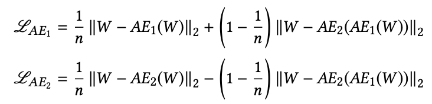

### Introduction

USAD 모델의 구조를 설명하기 앞서 Auto-encoder(AE)와 GAN 에서의 이상탐지의 장단점을 아는 것이 중요하다. 먼저 AE 기반의 이상탐지는 학습 단계와 탐지 단계로 구분할 수 있다. 학습 단계에서는 모델이 정상 데이터를 압축과 복원하는 과정을 거치면서 복원된 데이터와 원본 데이터 간의 차이(reconstruction error)를 최소화하도록 만들어지고, 탐지 단계에서는 비정상과 정상 데이터 모두 넣어 특정 threshold (aka anomaly score)을 넘기면 비정상, 넘기지 못하면 정상으로 이상여부를 판단한다. 하지만 AE는 압축하는 과정에서 불필요한 노이즈를 제거하기 때문에 비정상 데이터가 정상 데이터와 거의 비슷하다면 reconstruction error는 작아질 것이고, 비정상으로 감지되지 못할 것 이다. 

GAN 기반의 이상탐지 경우 입력데이터를 압축하고 복원하는 것은 Generator가 담당한다. 이때 Generator의 주된 목표는 Discriminator가 구분하지 못할 정도로 실제데이터와 유사한 데이터를 지속적으로 만드는 것이기 때문에 Generator에서의 Encoder와 Decoder는 비정상과 정상 데이터 정보를 모두 가지고 있다. 그리고 Discriminator는 Generator가 생성데이터가 비정상인지 정상인지 구별하는 역할을 한다. 하지만 GAN 모델도 완벽한 것은 아니다. GAN은 mode-collapse와 non-convergence를 단점으로 가지고 있어 불안정적인 면도 있다.

이 문제를 해결하고 GAN과 AE 장점만으로 만든 이상 탐지 모델이 USAD이다.

### Architecture
<center></center>

USAD 는 Phase 1 (AE Training) 과 Phase 2 (Adversarial Training) 단계로 이뤄져있다. 첫 번째 단계에서는 각각의 AE를 원래의 입력으로 잘 복원되도록 학습하는 것이다.실제데이터 W는 인코더 E에 의해 Latent Space Z로 압축되고 각각의 디코더에 의해 복원된다. 이 부분에 해당되는 Loss Function은 다음과 같다.

$$
L_{AE_{1}} = ||W - AE_{1}(W)||_2
$$


$$
L_{AE_{2}} = ||W - AE_{2}(W)||_2
$$

두 번째 단계에서는 $AE_{2}$가 실제 데이터와 $AE_{1}(W)$를 잘 구분할 수 있도록 학습한다. 반면 $AE_{1}$는 $AE_{2}$의 성능을 저하 시키도록 학습된다. 즉 $AE_{1}$(GAN의 Generator)는 W와 $AE_{2}$의 차이를 최소화 하는 것이고 $AE_{2}$ (GAN의 Discriminator)는 이 차이를 최대화 하는 것이다. 

$$
L_{AE_{1}} = +||W - AE_{2}(AE_{1}(W))||_2
$$


$$
L_{AE_{2}} = -||W - AE_{2}(AE_{1}(W))||_2
$$

최종 Loss Function은 아래와 같다.

<center></center>


### USAD Tensorflow Implementation

#### 데이터: 
- https://drive.google.com/open?id=1rVJ5ry5GG-ZZi5yI4x9lICB8VhErXwCw
- https://drive.google.com/open?id=1iDYc0OEmidN712fquOBRFjln90SbpaE7

```python
import os
os.environ["TF_CPP_MIN_LOG_LEVEL"] = "2"

import numpy as np
import tensorflow as tf
import pandas as pd
from tensorflow.keras import Model
from tensorflow.keras.layers import Layer, Dense
from sklearn.metrics import roc_curve,roc_auc_score, accuracy_score, f1_score
from sklearn.datasets import make_classification
from sklearn.model_selection import train_test_split
from sklearn import preprocessing

CONFIG = {
    "Batch": 7919,
    "Window": 12,
    "Hidden": 100,
    "Epoch": 100
}

class Encoder(Layer):
    def __init__(self, in_size, latent_size):
        super(Encoder, self).__init__()
        self.linear1 = Dense(int(in_size/2), input_shape=(in_size,), activation = "relu")
        self.linear2 = Dense(int(in_size/4), input_shape=(int(in_size/2),), activation = "relu")
        self.linear3 = Dense(latent_size, input_shape=(int(in_size/4),), activation = "relu")
        
    def call(self, inputs):
        x = self.linear1(inputs)
        x = self.linear2(x)
        x = self.linear3(x)
        return x
    
class Decoder(Layer):
    def __init__(self, latent_size, out_size):
        super(Decoder, self).__init__()
        self.linear1 = Dense(int(out_size/4), input_shape=(latent_size,), activation = "relu")
        self.linear2 = Dense(int(out_size/2), input_shape=(int(out_size/4),), activation = "relu")
        self.linear3 = Dense(out_size, input_shape=(int(out_size/2),), activation = 'sigmoid')

    def call(self, inputs):
        x = self.linear1(inputs)
        x = self.linear2(x)
        x = self.linear3(x)
        return x

class USAD(Model):
    def __init__(self, w_size, z_size):
        super(USAD, self).__init__()
        self.encoder = Encoder(w_size, z_size)
        self.decoder1 = Decoder(z_size, w_size)
        self.decoder2 = Decoder(z_size, w_size)
        
    def call(self, inputs, epoch):
        z = self.encoder(inputs)
        w1 = self.decoder1(z)
        w2 = self.decoder2(z)
        w3 = self.decoder2(self.encoder(w1))
        loss1 = 1/epoch*tf.reduce_mean((inputs-w1)**2)+(1-1/epoch)*tf.reduce_mean((inputs-w3)**2)
        loss2 = 1/epoch*tf.reduce_mean((inputs-w2)**2)-(1-1/epoch)*tf.reduce_mean((inputs-w3)**2)
        return loss1, loss2


def generate_dataset(batch_size, window_size):
    normal = pd.read_csv("Manufacturing Dataset/test/SWaT_Dataset_Normal_v1.csv", low_memory=False)#, nrows=1000)
    normal = normal.drop(["Timestamp" , "Normal/Attack" ] , axis = 1)

    # Transform all columns into float64
    for i in list(normal): 
        normal[i]=normal[i].apply(lambda x: str(x).replace("," , "."))
    normal = normal.astype(float)
    
    min_max_scaler = preprocessing.MinMaxScaler()
    x = normal.values
    x_scaled = min_max_scaler.fit_transform(x)
    normal = pd.DataFrame(x_scaled)

    attack = pd.read_csv("Manufacturing Dataset/test/SWaT_Dataset_Attack_v0.csv",sep=";", low_memory=False)#, nrows=1000)
    labels = [ float(label!= 'Normal' ) for label  in attack["Normal/Attack"].values]
    attack = attack.drop(["Timestamp" , "Normal/Attack" ] , axis = 1)
    
    for i in list(attack):
        attack[i]=attack[i].apply(lambda x: str(x).replace("," , "."))
    attack = attack.astype(float)
    x = attack.values
    x_scaled = min_max_scaler.fit_transform(x)
    attack = pd.DataFrame(x_scaled)
    
    windows_normal=normal.values[np.arange(window_size)[None, :] + np.arange(normal.shape[0]-window_size)[:, None]]
    windows_attack=attack.values[np.arange(window_size)[None, :] + np.arange(attack.shape[0]-window_size)[:, None]]

    windows_normal_train = windows_normal[:int(np.floor(.8 *  windows_normal.shape[0]))]
    windows_normal_val = windows_normal[int(np.floor(.8 *  windows_normal.shape[0])):int(np.floor(windows_normal.shape[0]))]

    return windows_normal_train, windows_normal_val, windows_attack, labels

windows_normal_train, windows_normal_val, windows_test, y_test = generate_dataset(CONFIG["Batch"], CONFIG["Window"])

w_size=windows_normal_train.shape[1] * windows_normal_train.shape[2]
z_size=windows_normal_train.shape[1] * CONFIG["Hidden"]

train_dataset = tf.data.Dataset.from_tensor_slices(
    windows_normal_train.astype(np.float32).reshape([windows_normal_train.shape[0], w_size])
).batch(CONFIG["Batch"], drop_remainder=False)

val_dataset = tf.data.Dataset.from_tensor_slices(
    windows_normal_val.astype(np.float32).reshape([windows_normal_val.shape[0], w_size])
).batch(CONFIG["Batch"], drop_remainder=False)

test_dataset = tf.data.Dataset.from_tensor_slices(
    windows_test.astype(np.float32).reshape([windows_test.shape[0], w_size])
).batch(CONFIG["Batch"], drop_remainder=False)

windows_labels=[]
for i in range(len(y_test) - CONFIG["Window"]):
    windows_labels.append(list(np.int_(y_test[i:i+CONFIG["Window"]])))
y_test = [1.0 if (np.sum(window) > 0) else 0 for window in windows_labels ]

model = USAD(w_size, z_size)
optimizer1 = tf.optimizers.Adam(learning_rate = 0.001)
optimizer2 = tf.optimizers.Adam(learning_rate = 0.001)
for epoch in range(1, CONFIG["Epoch"] + 1):
    for step, batch in enumerate(train_dataset):            
            with tf.GradientTape() as tape1, tf.GradientTape() as tape2:
                loss1,loss2 = model(batch, epoch, training = True)
                grads1 = tape1.gradient(loss1, model.encoder.trainable_variables + model.decoder1.trainable_variables)
                grads2 = tape2.gradient(loss2, model.encoder.trainable_variables + model.decoder2.trainable_variables)
                optimizer1.apply_gradients(zip(grads1, model.encoder.trainable_variables + model.decoder1.trainable_variables))
                optimizer2.apply_gradients(zip(grads2, model.encoder.trainable_variables + model.decoder2.trainable_variables))
                
    loss1_l, loss2_l = [], []
    for step, batch in enumerate(val_dataset):
        loss1, loss2 = model(batch, epoch, training = False)
        loss1_l.append(loss1)
        loss2_l.append(loss2)
    loss1_avg = tf.reduce_mean(loss1_l)
    loss2_avg = tf.reduce_mean(loss2_l)
    print("Epoch [%d]" % (epoch), 'val_loss1:', str(loss1_avg.numpy()) + ', val_loss2:', loss2_avg.numpy())

```

### Reference:
- https://github.com/manigalati/usad
- https://dl.acm.org/doi/10.1145/3394486.3403392
