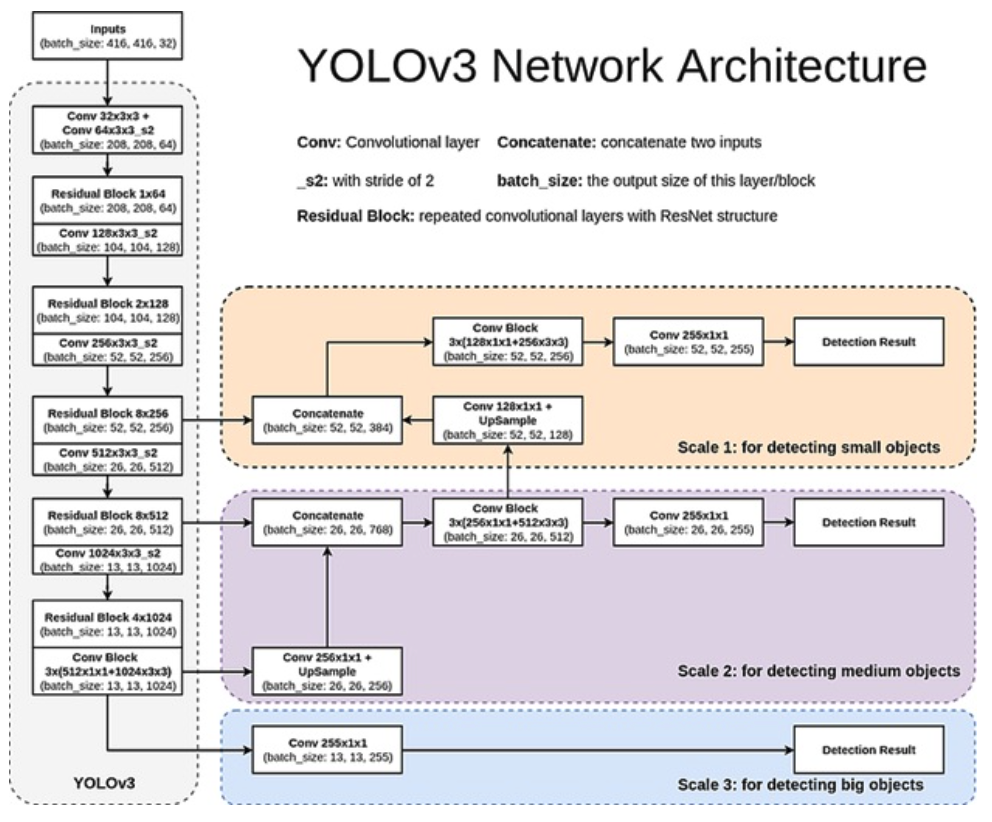

### Introduction 

2015년에 바운딩박스와 클래스를 회귀 방식으로 객체 탐지하는 YOLO(You Only Look Once) 모델이 제안됐다. 3년이 지난 후 UW의 Joseph Redmon과 Ali Farhardi는 YOLO를 업그레이드해서 YOLOv3를 다시 제안했다. YOLOv3는 end-to-end로 학습되는 single-stage 모델로 입력 이미지에서 다양한 객체들을 빠르게 검출할 수 있는 능력으로 유명하다. 또한 YOLOv3에서는 Darknet-53이라는 새로운 백본 네트워크가 도입되어 이전 버전보다 더 높은 정확도를 제고한다. 이 알고리즘은 입력 이미지를 그리드 셀로 나누고, 각 셀이 특정 개수의 bounding box를 예측하는 방식을 사용된다. 그리고 예측된 bounding box는 해당 객체의 클래스와 confidence score를 가진다.

#### Architecture

 
YOLO v3는 서로 다른 3개의 scale을 사용하여 최종 결과를 예측한다. 먼저 416x416 크기의 이미지를 모델에 넣어서 크기가 52x52, 26x26, 13x13이 되는 레이어에서 특징맵을 추출한다. 그 다음 가장 높은 단계에서 추출된 특징맵을 1x1, 3x3 Conv 레이어로 구성된 네트워크에 넣어주고, Filter의 개수가 512가 되는 지점에서 2배로 upsampling 한 뒤, 바로 아래 단계에서 추출된 특징맵과 Concatenate해준다. 이 과정을 가장 밑 단계에서 추출된 특징맵에서도 적용한다. 이를 통해 총 3개의 Scale를 가진 새로운 특징맵을 얻을 수 있다. 그리고 이 때 각 Scale의 특징맵의 채널 개수가 (255 = 3 x (4 + 1 + Num of Classes))가 되도록 만들어줘야 한다. 

이 방법을 통해 더 높은 단계에서의 특징맵으로 부터 fine-grained 정보를 얻고, 더 낮은 단계에서의 특징맵으로부터 더 유용한 semantic 정보를 얻을 수 있다. 

#### Feature Extractor

YOLO v3에서는 Darknet-53을 backbone 으로 사용한다. Darkenet-53은 ResNet-101보다 1.5배 빠르고, ResNet-152와 비슷한 성능을 보이지만 2배 이상 빠르다.

#### Training Train YOLOv3
앞서 얻은 multi-scale feature maps를 loss function을 통해 학습시킨다.

1. bounding box offset의 MSE(Mean Squared Error)
2. 객체를 예측하도록 할당된(responsible for) bounding box의 objectness score의 BCE(Binary Cross Entropy)
3. 객체를 예측하도록 할당되지 않은 bounding box의 no objectness score의 BCE
4. bounding box의 multi-class BCE

그리고 Inference 시에는 마지막 예측 결과에 NMS(Non Maximum Suppression)을 적용한다. 

#### Results

#### Reference:
- https://arxiv.org/pdf/1804.02767.pdf
- https://d33wubrfki0l68.cloudfront.net/c6fd049f28b66dbd35faed6965905ec6281f7d7d/c0399/assets/images/yolo/yolo-architecture.webp
- https://towardsdatascience.com/dive-really-deep-into-yolo-v3-a-beginners-guide-9e3d2666280e

<!-- 바운딩 박스와 클래시파이 하는 것은 regression 방식으로 구현했음.
1. 인풋이 들어오면 S x S 그리드로 만듦 (S = 7)
- 이미지마다 중심이란 곳 사물을 검출해야 한다
2. 그리드는 B 바운드 박스를 가질 수 있음 오브젝트가 두 개 있지 않을 거다
- 각각의 바운딩 박스는 5개 예측값 x, y(center), w, h and confidence
- confidence = P(object) * IOU (pred, GT)
3. Each grid cell also predicts C conditional class probabilities
- Output tensor S * S * (5B + C)

NMS algorithm
1. Select the box with highest objectiveness (confidence) score
2. Computer IOU between this box and all other boxes
3. Remove the bounding with IOU > 50%
4. move to the next highest confidnece score
5. Repeat to 2-4 

Loss
1. Squared loss on BB location (we only consider target bounding box with GT)
2. Squared loss on BB size (sqrt to better consider small objects) 작은 물체가 잘 검출 되게끔
3. Confidence score regression when an object exists (c_i = 1)
4. Confidence score regression when no object exists (c_i = 0)
- 데이터 임밸런스 문제 lambda_noobj (1/10x)
5. classification  -->