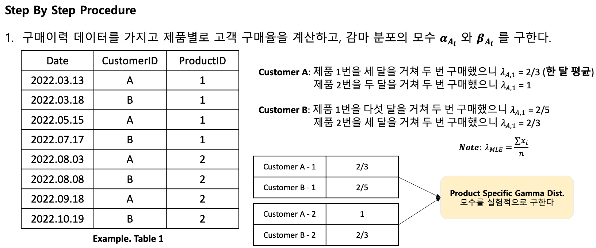
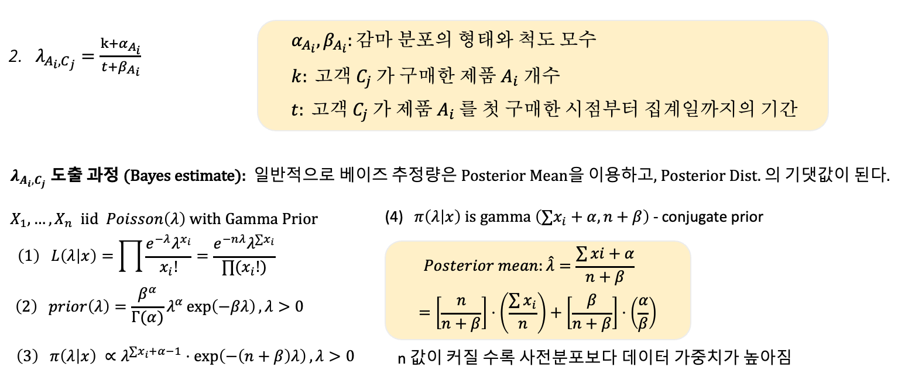
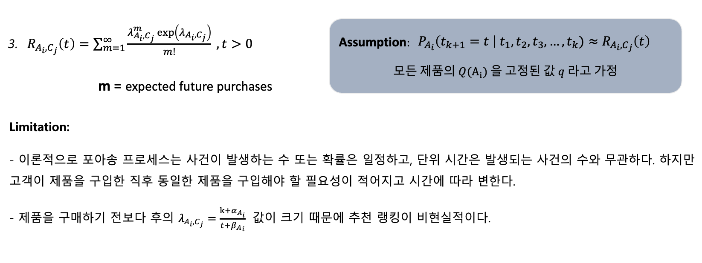
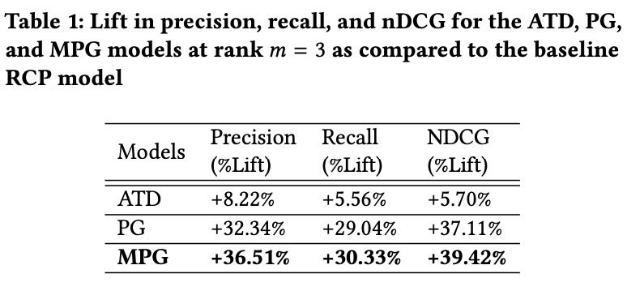
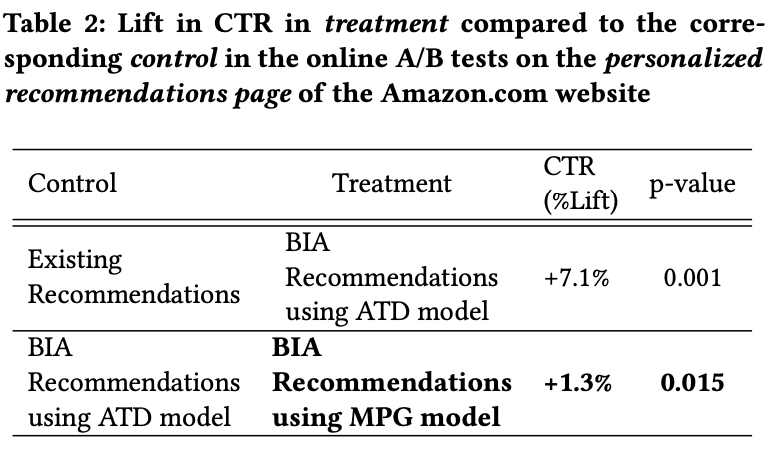

### Current Problem

이커머스 기업이 사용하는 추천 기능은 대부분 어떤 상품을 추천할 것인가에만 맞추어져 있다. 이에 반해 고객이 한 번 이상 구매한 상품을 언제 추천해야 하는 것인지에 대한 연구가 활발히 이루어지지 못하고 상태이다. 특히 생활용품과 같이 반복적으로 구매가 일어나는 상품의 경우, 재구매 시기를 적절히 예상하여 상품을 추천해준다면 ‘보다 더 편리한’ ‘더 나은’ 고객 경험을 제공해줄 수 있다. 

아마존에서 발표한 **Repeat Purchase Recommendations** 은 고객의 과거 구매 데이터를 바탕으로 고객이 필요한 상품을 다시 추천해주는 기능이다. 예를 들어 1개월 전 아마존 어플에서 펩시 (210ml x 30캔) 을 구매한 이력이 있는 고객에게 상품을 시기적절하게 추천해주는 기능이다.

### Purchase Probability Density (PPD)

**PPD** 를 다음과 같이 정의할 수 있다
$$
P_{A_i}(t_{k+1}=t| t_{1}, t_{2}, t_{3}, …, t_{k})
$$

고객의 구매이력 정보를 가지고 고객의 제품 재구매 확률을 계산하고 이를 기반으로 상품을 추천까지 해준다. **Bhagat et al. 2018** 논문에서는 RCP (Repeat Customer Probability), ATD (Aggregate Time Distribution), PG (Poisson-Gamma), MPG (Modified Poisson-Gamma) 총 4개의 모형을 사용해 $P_{A_i} (⋅)$ 구하고자 했다

**Assumption1**: 서로 다른 제품을 구매할 사건은 독립이다

**Assumption2**: 
$$
P_{A_i} (t_{k+1}=t\ | \ t_1, t_2, t_3, …, t_k)≈Q(A_i)\cdot R_{A_i} (t_{k+1}| t_1, .., t_k)
$$

$Q(A_i)$: 고객이 제품을 구매한 횟수가 k 인 경우 (k+1) 번째로 제품을 구매할 재구매 확률

$R_{A_i}$: 고객이 제품을 재구매할 때의 $t_{k+1}$ 분포

### 1. Repeat Customer Probability (RCP)

$$
𝑅𝐶𝑃_{𝐴_𝑖}= \frac{\# \ customers \ who \ bought \  product \ 𝐴_𝑖 \ more \ than \ once}{\# \ customers \ who \ bought \  product \ 𝐴_𝑖 \ at \ least \ once}
$$

제품 $A_i$ 을 구매한 고객의 수를 활용한 베이스라인 확률 모델 (**Time-Independent**)

**Assumption**: 
$$
P_{A_i} (t_{k+1}=t\ | \ t_1, t_2, t_3, …, t_k)≈Q(A_i)≈RCP_{A_i}
$$

여기서 $R_{A_i}(\cdot)$ 은 고정된 r 값 이라고 가정한다.

임계값을 사용해 추천 모델의 품질 향상: **$RCP_{A_i}$ > Threshold**

**Limitation:** 고객이 방금 전에 구매한 제품이 여전히 추천 제품 우선 순위에 올라가 있을 수 있음 

### **2. Aggregate Time Distribution** **(ATD)** 모델

$$
𝑅_{𝐴_𝑖} (𝑡)=ln⁡ℕ(𝑡;\mu_{i}, \sigma_{i})=\frac{1}{\sqrt{2𝜋}  𝑡\cdot\sigma_{i}}⋅exp⁡\bigg[-\frac{(lnt - \mu_i)^2}{2\sigma_i^2} \bigg], 𝑡>0
$$

제품 $A_i$를 재구매까지 소요된 기간이 로그 정규 분포를 따른다 것을 실험적으로 확인했다. 로그 정규 분포는 Positively Right Skewed 한 분포이기 때문에 항상 양수값만을 가진다. 따라서 음수값을 가짐으로 인해 발생하는 문제에 대한 대안이 될 수 있다. 예를 들어 상품을 재구매까지의 간격, 첫 구매 소요 시간, 구매 가격대 등은 전부 양수 값만 갖는다. 

로그 정규 분포를 사용해 어떤 사건의 발생하는 정도가 급격히 증가했다가 낮아지는 것을 모델화 수 있다. 예를 들어, 물건을 구입하거나 이사를 가거나 하는 사건은 한 번 발생하고 나면 발생 확률이 급격이 낮아지는 사건을 모델화 할 수 있다.

주어진 데이터가 로그 정규 분포를 가정하고 있는지 확인하기 위해 MLE로 모수를 구했다. 로그 정규 분포의 모수 $\mu_i$ 와 $\sigma_i$ 를 구하는 방법은 다음과 같다

$$
Likelihood \ LN \frac{1}{(2\pi)^{\frac{n}{2}} \cdot (\sigma_i^2)^{\frac{n}{2}}} \cdot \prod \bigg(\frac{1}{t_z} \bigg) \cdot exp \bigg(-\frac{1}{2\sigma^2_i} \sum ln(t_z - \mu_i)^2 \bigg)
$$

$$
Likelihood \ LLN = -\frac{𝑛}{2}ln⁡(2\pi)−\frac{𝑛}{2}ln⁡(\sigma_i^2)−\frac{1}{2\sigma_i^2}\sum ln(t_z - \mu_i)^2 - \sum ln(t_z)
$$

$$
\hat{\mu_{mle}} = \frac{1}{n}\sum ln(t_z), \ \hat{\sigma_{mle}^2} = \frac{1}{n} \sum (lnt - \mu_i)^2
$$

그리고 논문에서는 데이터를 theoretical 로그정규분포와 비교하기 위해 qqplot을 사용했다. 

- **그래프 왼쪽 아래, 점들이 선 위** - 데이터 분포의 왼쪽 꼬리가 로그정규분포의 것보다 짧다.
- **그래프 오른쪽 위, 점들이 선 아래** - 데이터 분포의 오른쪽 꼬리가 로그정규분포의 것보다 짧다.

**Assumption**: 
$$
P_{A_i} (t_{k+1}=t\ | \ t_1, t_2, t_3, …, t_k)≈R_{A_i}(t)
$$

여기서 $Q_{A_i}(\cdot)$ 은 고정된 q 값 이라고 가정한다.

임계값을 사용해 추천 모델의 품질 향상: $R_{A_i}(t)$ **> Threshold**

**Limitation:** 사람마다 제품을 사용하는 속도는 전부 다 다름. 어떤 사람은 각휴지 화장지 20매를 3주 만에 사용하고 어떤 고객은 동일 제품을 1주일만에 사용할 수 있으므로 사람에 따라 제품 구매 주기가 다를 수 있음.

### **3. Poisson-Gamma Mixture** **(PG)** 모델

포아송 분포와 감마 분포의 혼합 모형은 음이항 분포 (Negative Binomial Distribution) 라고도 부른다. 두 분포를 함께 사용한다는 건 포아송의 모수가 감마 분포를 따르도록 만드는 것을 의미한다. 포아송 분포의 모수는 일정한 기간 동안의 재구매율이고, 고객마다 재구매율이 다르기 때문에 감마분포를 따른다고 가정한다.

$$
𝑋 \sim 𝑃𝑜𝑖𝑠𝑠𝑜𝑛(\lambda_i)
$$

$$
\lambda_i \sim 𝐺𝑎𝑚𝑚𝑎(\alpha, \beta)
$$

**관련 기초 통계 분포 개념정리:**

**포아송 분포:** 단위 시간 동안의 성공 횟수에 대한 분포 (기간을 어떻게 정의하냐에 따라 ‘Rate’로도 표현 가능) 

**감마 분포:** 사건을 n번 시행할 때까지의 총 시간을 분포 (지수 분포는 특수한 케이스)

**음이항 분포:** 사건이 n번 발생할 때까지의 시행하는 경우의 시행 횟수의 분포 (기하 분포는 특수한 케이스)

### **4. Modified Poisson-Gamma** **(MPG)** 모델

$$
\lambda_{A_{i,}C_{j}} = \frac{k + \alpha_{A_i}}{t_{purch} + 2 \cdot |t_{mean} - t| + \beta_{A_i}}
$$

$$t_{purch}$$: 첫 구매부터 마지막 구매까지의 기간

$$t_{mean}$$: 평균 재구매 간격

$$t$$: 마지막 구매부터 집계일까지의 기간

변형된 포아송-감마 혼합 모형은 하나의 재구매율 $$\lambda$$ 모수를 사용하고, $$\lambda$$  는 고객이 가장 최근에 재구매한 제품 $$A_i$$의 **Time** 과 **Dependent** 하다고 가정한다. 그리고 PG 모형과 동일하게 재구매율은 감마분포를 따른다고도 가정한다. (MPG 모델에서의 $$\lambda$$ 는 $$t<2 ∗ t_{mean}$$ 일 때만 사용한다 )

포아송 모수($$\lambda$$)는 t = 0 to t = $$t_{mean}$$  일 때 커지고, t = $$t_{mean}$$  to t = 2 ∗ $$t_{mean}$$ 일때는 작아지는 구조이다. 고객이 평균적으로 제품 $$A_i$$  를 재구매 하는 시간 간격과 가까워지면 재구매율이 높아지고, 멀어질 수록 재구매율이 낮아지게 만들어졌다.

$$
P_{A_i} (t_{k+1}=t\ | \ t_1, t_2, t_3, …, t_k)≈Q(A_i) \cdot R_{A_{i,}C_{j}}(t)
$$

where $$Q(A_i) = 𝑅𝐶𝑃_{𝐴_𝑖}= \frac{\# \ customers \ who \ bought \  product \ 𝐴_𝑖 \ more \ than \ once}{\# \ customers \ who \ bought \  product \ 𝐴_𝑖 \ at \ least \ once}$$

$$RCP_{A_i}$$ 은 time-independent signal 도 추천모델에 활용한다. 특정 상품을 재구매 한다는 것은 신규 고객 혹은 기존 고객을 만족시키고 있다는 의미로 해석할 수 있다. 만약 $$RCP_{A_i}$$ 계산을 생략하고 고객이 최근에 구매한 제품을 바탕을 추천을 한다면 sub-optimal 한 고객경험을 제공하게 된다.

### Offline Experiments 결과

- ATD, PG, 그리고 MPG 모델이 RCP 베이스라인 모델보다 성능이 좋음.
- PG/MPG 은 총 구매 행동 패턴 외에 고객의 구매 신호를 사용할 수 있어서 RCP/ATD 보다 성능이 좋음.
- Time-dependent/independent signal 를 모두 사용한 MPG 모델이 성능이 가장 좋음.

### OnlineExperiments 결과

- 기존 추천모델보다 ATD 모델이 CTR 7.1% 높음
- ATD 모델보다 MPG 모델이 CTR 1.3% 높음
- 오프라인 실험에서의 결과와 일치함 (ATD < MPG 성능)

#### Reference:

- https://assets.amazon.science/40/e5/89556a6341eaa3d7dacc074ff24d/buy-it-again-modeling-repeat-purchase-recommendations.pdf